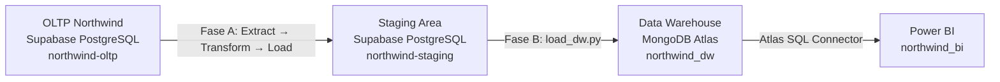

# genera la matriz fuente destino de estre proyecto

**Fecha:** 2026-06-08  
**Agente:** cursor  
**Proyecto/contexto:** d-Github-repos-advanced-db-final-project  
**Sesión:** `3858ee5a-ea41-4563-ab8a-effec70e90a1`  
**Origen:** `C:\Users\david\.cursor\projects\d-Github-repos-advanced-db-final-project\agent-transcripts\3858ee5a-ea41-4563-ab8a-effec70e90a1\3858ee5a-ea41-4563-ab8a-effec70e90a1.jsonl`

## Mensajes

### Usuario

genera la matriz fuente destino de estre proyecto

### Asistente

Voy a revisar el ETL y el esquema del proyecto para armar la matriz fuente–destino.


[tool:SemanticSearch]
[tool:Glob]
[tool:Grep]

### Asistente

[tool:Read]
[tool:Read]
[tool:Read]
[tool:Glob]

### Asistente

[tool:Read]
[tool:Read]
[tool:Read]

### Asistente

[tool:Read]
[tool:Read]

### Asistente

Aquí tienes la **matriz fuente → destino** del proyecto Northwind BI, basada en el ETL (`etl/`), el DDL de staging y el modelo semántico de Power BI (`proyecto-bi/`).

## Arquitectura del flujo de datos



| Capa | Tecnología | Ubicación | Rol |
|------|------------|-----------|-----|
| **Fuente (OLTP)** | PostgreSQL 15+ (Supabase) | `northwind-oltp` | Sistema operacional Northwind (solo lectura) |
| **Staging** | PostgreSQL 15+ (Supabase) | `northwind-staging` | Landing zone limpia y auditable |
| **Bodega (DW)** | MongoDB Atlas | `northwind_dw` | Modelo estrella (7 dims + 1 hecho) |
| **Consumo BI** | Power BI Desktop | `proyecto-bi/northwind_bi` | Dashboards y reportes |

---

## Fase A — OLTP → Staging Area

| # | Tabla fuente (OLTP) | Tabla destino (Staging) | Transformador | Columnas derivadas | Metadatos de linaje |
|---|---------------------|-------------------------|---------------|-------------------|---------------------|
| 1 | `Categories` | `stg_categories` | `transform_categories` | — | `STG_LOAD_DATE`, `STG_SOURCE_NAME`, `STG_BATCH_ID` |
| 2 | `Suppliers` | `stg_suppliers` | `transform_suppliers` | — | idem |
| 3 | `Shippers` | `stg_shippers` | `transform_shippers` | — | idem |
| 4 | `Customers` | `stg_customers` | `transform_customers` | — | idem |
| 5 | `Employees` | `stg_employees` | `transform_employees` | `FullName` | idem |
| 6 | `Region` | `stg_region` | *(passthrough)* | — | idem |
| 7 | `Territories` | `stg_territories` | *(passthrough)* | — | idem |
| 8 | `EmployeeTerritories` | `stg_employee_territories` | *(passthrough)* | — | idem |
| 9 | `Products` | `stg_products` | `transform_products` | `STG_AlertaBajoReorden`, `STG_StockProyectado` | idem |
| 10 | `Orders` | `stg_orders` | `transform_orders` | `STG_DiasEntrega`, `STG_EntregaPuntual` | idem |
| 11 | `Order Details` | `stg_order_details` | `transform_order_details` | `STG_ValorNeto` | idem |

**Orden de carga:** definido en `SOURCE_TABLES` de `config.py` (dimensiones antes que hechos).

**Volumen típico:**

| Tabla fuente | Registros |
|--------------|-----------|
| Categories | 8 |
| Suppliers | 29 |
| Shippers | 3 |
| Customers | 91 |
| Employees | 9 |
| Region | 4 |
| Territories | 53 |
| EmployeeTerritories | 49 |
| Products | 77 |
| Orders | 830 |
| Order Details | 2.155 |

**Transformaciones aplicadas (Fase A):**

| Código | Regla | Tablas afectadas |
|--------|-------|------------------|
| TR-001 | UPPER + TRIM en texto | Categories, Suppliers, Shippers, Customers, Employees, Products, Orders |
| TR-002 | MONEY → DECIMAL(18,2) | Products, Orders, Order Details |
| TR-003 | DATETIME → DATE | Employees, Orders |
| TR-004 | BIT → int | Products (`Discontinued`) |
| TR-005 | REAL → DECIMAL(5,2) | Order Details (`Discount`) |
| TR-006 | Valor neto | Order Details → `STG_ValorNeto` |
| TR-007 | Días de entrega | Orders → `STG_DiasEntrega` |
| TR-008 | Puntualidad | Orders → `STG_EntregaPuntual` |
| TR-009 | Alerta bajo reorden | Products → `STG_AlertaBajoReorden` |
| TR-010 | Stock proyectado | Products → `STG_StockProyectado` |
| TR-013 | Nombre completo | Employees → `FullName` |

---

## Fase B — Staging Area → Bo

_[truncado]_

### Usuario

explicame que es la matriz fuente destino

### Asistente

## ¿Qué es la matriz fuente → destino?

Es un **documento de trazabilidad (lineage)** que describe **de dónde sale cada dato** y **a dónde llega** a lo largo del pipeline de datos. Responde tres preguntas básicas:

1. **¿Qué tabla o sistema origen alimenta cada destino?**
2. **¿Qué transformaciones se aplican en el camino?**
3. **¿Cómo se relacionan los campos entre capas?**

No es código ni un diagrama técnico detallado: es una **tabla de mapeo** que cualquier persona del proyecto puede leer para entender el flujo de información.

---

## ¿Para qué sirve?

| Propósito | Ejemplo en tu proyecto |
|-----------|------------------------|
| **Documentar el ETL** | Saber que `Orders` va a `stg_orders` y luego participa en `fact_ventas` |
| **Auditar calidad** | Si `total_venta` sale mal, puedes rastrear hasta `Order Details.UnitPrice` |
| **Onboarding** | Un compañero nuevo entiende la arquitectura sin leer todo el código |
| **Entregables académicos** | Es un requisito típico en proyectos de BI / bases de datos avanzadas |
| **Gobernanza de datos** | Saber qué campos son copia directa, cuáles son calculados y cuáles son sintéticos |

---

## Cómo se lee (con tu proyecto)

Tu arquitectura tiene **tres saltos** principales:

```
OLTP (Northwind)  →  Staging (stg_*)  →  DW (dim_*, fact_*)  →  Power BI
```

La matriz documenta cada salto. Por ejemplo:

**Fase A — fuente operacional → staging**

| Fuente | Destino | Qué pasa |
|--------|---------|----------|
| `Orders` | `stg_orders` | Se limpian fechas y se calculan `STG_DiasEntrega`, `STG_EntregaPuntual` |

**Fase B — staging → bodega analítica**

| Fuentes staging | Destino DW | Qué pasa |
|-----------------|------------|----------|
| `stg_order_details` + `stg_orders` + dimensiones | `fact_ventas` | Se arma la tabla de hechos con ventas, margen y entregas |

**Lineage de un campo concreto**

| Campo final | Origen | Cálculo |
|-------------|--------|---------|
| `fact_ventas.total_venta` | `Order Details` | `UnitPrice × Quantity × (1 - Discount)` |

Eso último es la parte más valiosa: no solo dice *qué tabla va a qué tabla*, sino *cómo nace cada métrica importante*.

---

## ¿Qué NO es?

- **No es el modelo dimensional** (el esquema estrella con relaciones entre `dim_*` y `fact_*`).
- **No es el diccionario de datos** completo (aunque se solapa: la matriz se centra en el *camino*, no en la definición de cada columna).
- **No es el diagrama ERD** de la base operacional.

La matriz complementa esos documentos: el ERD muestra *cómo está modelada la fuente*, el esquema estrella muestra *cómo se analiza*, y la matriz fuente-destino muestra *cómo se conectan ambos mundos*.

---

## Ejemplo mínimo

Imagina que alguien pregunta: *"¿De dónde sale el segmento Premium en el dashboard?"*

Con la matriz puedes seguir la cadena:

```
Customers.CompanyName
    → stg_customers (limpieza TR-001)
        → dim_cliente.segmento_cliente (regla: total_ventas > 10 000 → "Premium")
            → slicer en Power BI
```

Sin la matriz tendrías que revisar `transform.py`, `load_dw.py` y el modelo de Power BI por separado.

---

## En resumen

La **matriz fuente → destino** es el **mapa del viaje de los datos**: desde el sistema que los produce (Northwind OLTP) hasta donde se consumen (Power BI), pasando por cada capa intermedia (staging, bodega), indicando transformaciones y campos derivados en cada etapa.

En tu proyecto concreto, documenta las **11 tablas OLTP → 11 tablas staging → 8 colecciones MongoDB → 8 tablas s

_[truncado]_

### Usuario

te pregunto es porque yo debo ser capaz de explicar que se esta haciendo con cada tabla desde la fuente de datos hasta el datawarehouse. entonces necesito que me expliques bien

### Asistente

Te lo explico tabla por tabla, en el orden del pipeline, para que puedas contarlo en una defensa o entrega.


[tool:Read]
[tool:Read]

### Asistente

## La idea general (para abrir tu explicación)

En este proyecto los datos **no saltan directo** de Northwind al dashboard. Pasan por **tres capas**, cada una con un propósito distinto:

| Capa | Qué es | Para qué sirve |
|------|--------|----------------|
| **OLTP** (fuente) | Base operacional Northwind en Supabase | Donde se registran pedidos, clientes, productos en el día a día |
| **Staging** (`stg_*`) | Zona intermedia en otro Supabase | Copia limpia, con reglas de calidad y metadatos de auditoría |
| **Data Warehouse** (`dim_*`, `fact_*`) | Bodega analítica en MongoDB | Modelo estrella listo para consultas de BI (Power BI) |

El pipeline (`pipeline.py`) hace esto en orden:

1. **Extrae** de OLTP (solo lectura, `SELECT`)
2. **Transforma** en memoria con pandas (`transform.py`)
3. **Carga** en staging (`load_staging.py`) — full refresh con `TRUNCATE` + `INSERT`
4. **Lee** staging y **construye** el modelo dimensional (`load_dw.py`)
5. **Carga** MongoDB — también full refresh (`drop` + `insert`)

**Frase clave que puedes decir:** *"La fuente OLTP no se toca; staging desacopla y limpia; el DW reorganiza los datos en un esquema estrella para analizar ventas."*

---

## Qué le pasa a cada tabla de la fuente

A continuación, **cada tabla OLTP**, paso a paso.

---

### 1. `Categories` (categorías de producto)

**En la fuente:** catálogo de categorías (Bebidas, Condimentos, etc.).

**Extract:** se leen `CategoryID`, `CategoryName`, `Description`.

**Transform (`transform_categories`):**
- Limpieza de texto: `CategoryName` en mayúsculas y sin espacios extra (TR-001).

**Staging:** va a `stg_categories` + metadatos (`STG_LOAD_DATE`, `STG_SOURCE_NAME`, `STG_BATCH_ID`).

**Data Warehouse:** **no es una dimensión propia**. Se usa como **lookup** al construir `dim_producto`: se hace join por `CategoryID` para poner el nombre de categoría en cada producto.

**Cómo explicarlo:** *"Categories no genera una tabla dimensional separada; enriquece dim_producto con el nombre de la categoría."*

---

### 2. `Suppliers` (proveedores)

**En la fuente:** quién suministra cada producto.

**Transform (`transform_suppliers`):** limpieza UPPER/TRIM en `CompanyName`, `Country`, `City`, `ContactName`.

**Staging:** `stg_suppliers`.

**Data Warehouse:** igual que Categories — **no tiene dimensión propia**. Alimenta `dim_producto` con el nombre del proveedor (`proveedor`).

**Cómo explicarlo:** *"Suppliers aporta contexto al producto, no una dimensión independiente."*

---

### 3. `Shippers` (transportistas)

**En la fuente:** empresas de envío (FedEx, etc.).

**Transform (`transform_shippers`):** limpieza de `CompanyName`.

**Staging:** `stg_shippers`.

**Data Warehouse:** sí genera **`dim_shipper`**, pero **enriquecida** con datos de `stg_orders`:
- Se promedia `STG_DiasEntrega` por `ShipVia` (ID del transportista).
- Resultado: cada shipper con `avg_delivery_days`.

**También aparece en** `fact_ventas` como `shipper_id` (viene de `Orders.ShipVia`).

**Cómo explicarlo:** *"Shippers es dimensión de logística; además, las órdenes le aportan métricas de tiempo de entrega."*

---

### 4. `Customers` (clientes)

**En la fuente:** quién compra.

**Transform (`transform_customers`):** limpieza de `CustomerID`, `CompanyName`, `Country`, `City`.

**Staging:** `stg_customers`.

**Data Warehouse — dos usos:**

**A) `dim_cliente`** (dimensión principal):
- Copia atributos del cliente (nombre, dirección, país, etc.).
- **Agrega métricas** cruzando con `stg_orders` y `stg_orde

_[truncado]_


## Enlaces
- Índice: [[cursor-import-index]]
- Home: [[Home]]
