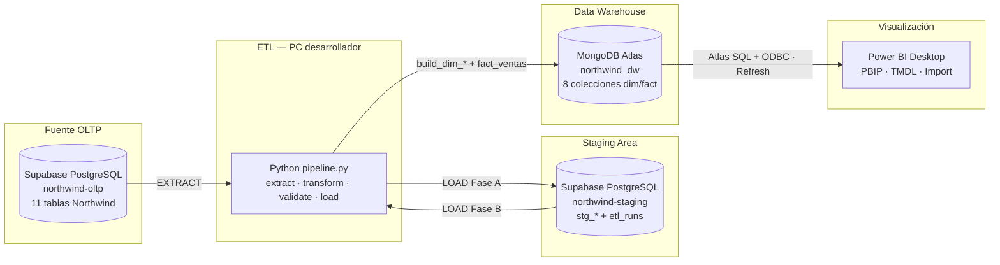
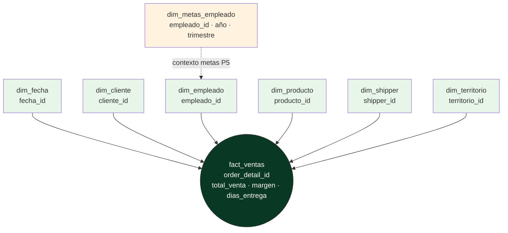
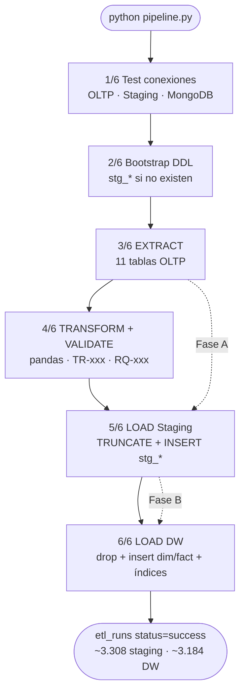

# agrega todo lo que se pide en el pdf del trabajo que debe tener en la parte 3.1 documento.

**Fecha:** 2026-06-09  
**Agente:** cursor  
**Proyecto/contexto:** d-Github-repos-advanced-db-final-project  
**Sesión:** `14884b94-2ae1-4434-9e76-452d062249ba`  
**Origen:** `C:\Users\david\.cursor\projects\d-Github-repos-advanced-db-final-project\agent-transcripts\14884b94-2ae1-4434-9e76-452d062249ba\14884b94-2ae1-4434-9e76-452d062249ba.jsonl`

## Mensajes

### Usuario

agrega todo lo que se pide en el pdf del trabajo que debe tener en la parte 3.1 documento. genera todo lo que ahi se pide y agregalo al readme

### Asistente

Buscaré el PDF del trabajo y el README actual para identificar qué exige la sección 3.1.


[tool:Glob]
[tool:Grep]

### Asistente

[tool:Shell]
[tool:Read]

### Asistente

[tool:Shell]

### Asistente

[tool:Read]
[tool:Grep]

### Asistente

Revisando el README y el proyecto para redactar la sección 3.1 con el contenido que exige el PDF.


[tool:Read]
[tool:Read]
[tool:Read]
[tool:Read]
[tool:Read]

### Asistente

[tool:Read]
[tool:Read]
[tool:Read]

### Asistente

[tool:Grep]
[tool:Read]

### Asistente

[tool:Read]

### Asistente

Añadiendo la sección 3.1 completa al README, con los ocho capítulos que exige el PDF.


[tool:StrReplace]
[tool:StrReplace]

### Asistente

[tool:Delete]
[tool:Read]

### Asistente

Se agregó al README la sección completa **Documento de entrega — Parte 3.1**, según lo exige el PDF (`Trabajo Final Base de Datos Avanzadas.pdf`, sección 3.1).

### Contenido incluido (8 capítulos)

| Sección | Contenido |
|---------|-----------|
| **3.1.1** | Metodología Kimball, arquitectura en capas, herramientas (Python, Power BI, MongoDB) y justificación |
| **3.1.2** | Descripción de Northwind: 11 tablas, relaciones, campos clave y limitaciones |
| **3.1.3** | Matriz fuente → staging → DW con lineage de campos críticos |
| **3.1.4** | Diseño lógico y físico de la Staging Area (`stg_*`, `etl_runs`, índices) |
| **3.1.5** | Diseño lógico y físico del data mart (esquema estrella, colecciones MongoDB, índices, supuestos) |
| **3.1.6** | Diseño del ETL: fases A/B, diagrama de secuencia, módulos, flags y métricas |
| **3.1.7** | Transformaciones TR-001…TR-014, reglas RQ-xxx y transformaciones de Fase B |
| **3.1.8** | Diseño de visualizaciones: 4 páginas, mapa P1–P10, detalle por visual, medidas DAX |

### Ubicación

- En el **índice** bajo General, con enlace directo.
- En el cuerpo del README, justo después de [Preguntas de negocio](#preguntas-de-negocio-p1p10) y antes de [Arquitectura objetivo](#arquitectura-objetivo-cloud).

La sección está pensada como documento de entrega académico autocontenido, con referencias a las secciones técnicas del mismo README para más detalle (ETL, Power BI, etc.).

¿Quieres que también genere un PDF o Word aparte a partir de esta sección para entregarlo como archivo independiente?

### Usuario

eres capaz de construir el doccumento con el diseño del pdf del trabajo en un docx?

### Asistente

Revisando el PDF y el contenido del README para generar un DOCX con estructura y estilo académicos similares.


[tool:Shell]
[tool:Read]

### Asistente

[tool:Read]
[tool:Read]

### Asistente

Instalando `python-docx` y creando un script que genere el DOCX con la estructura académica del PDF.


[tool:Shell]

### Asistente

[tool:Shell]

### Asistente

[tool:Await]

### Asistente

[tool:Read]

### Asistente

Creando el script generador del DOCX con estilo académico similar al PDF.


[tool:Write]

### Asistente

[tool:Shell]

### Asistente

[tool:Await]

### Asistente

[tool:Shell]

### Asistente

[tool:Glob]

### Asistente

[tool:Read]

### Asistente

[tool:Shell]

### Asistente

Mejorando el documento: tabla de contenidos, fecha en español y referencia en el README.


[tool:StrReplace]
[tool:StrReplace]

### Asistente

[tool:Read]

### Asistente

[tool:StrReplace]
[tool:StrReplace]
[tool:StrReplace]
[tool:StrReplace]
[tool:StrReplace]

### Asistente

[tool:Shell]

### Asistente

Sí. Ya generé el documento Word con la estructura del PDF del trabajo.

### Archivo generado

**[`docs/Documento_Entrega_3_1_Northwind_BI.docx`](docs/Documento_Entrega_3_1_Northwind_BI.docx)**

### Diseño aplicado (similar al PDF del TF)

| Elemento | Detalle |
|----------|---------|
| **Portada** | Título centrado, universidad, asignatura, fecha en español |
| **Tipografía** | Times New Roman 12 pt (estilo académico/LaTeX) |
| **Numeración** | Secciones 1, 2, 3, 3.1, 3.1.1… como en el enunciado |
| **Índice** | Tabla de contenidos (actualizar campos al abrir en Word) |
| **Numeración de páginas** | Pie de página centrado |
| **Tablas** | Encabezados sombreados, bordes |
| **Bloques de código** | Consolas para diagramas, fórmulas y DAX |

### Contenido incluido

1. **Introduction** (1.1 ETL, 1.2 Visualización, 1.3 DW + selección del equipo)
2. **Preguntas de Negocio** (las 10 del PDF)
3. **Entregables 3.1** — los 8 capítulos completos:
   - Metodologías, arquitecturas, herramientas
   - Fuente de datos
   - Matriz fuente → destino
   - Staging Area (lógico + físico)
   - Bodega de datos (lógico + físico)
   - Diseño del ETL
   - Transformaciones
   - Visualizaciones
4. **3.2 Software**, **3.3 Sustentación**, **3.4 Plus**

### Regenerar o personalizar

```bash
python scripts/generate_documento_3_1.py
```

El script está en [`scripts/generate_documento_3_1.py`](scripts/generate_documento_3_1.py). Puedes editar ahí el nombre del equipo, ampliar tablas o ajustar estilos.

**Nota:** Al abrir el DOCX en Word, haz clic derecho en el índice → **Actualizar campo** para que se generen los números de página. Si quieres, puedo añadir logo de la UPC, portada más formal o exportarlo también a PDF.

### Usuario

Briefly inform the user about the task result and perform any follow-up actions (if needed). If there's no follow-ups needed, don't explicitly say that.

### Usuario

Briefly inform the user about the task result and perform any follow-up actions (if needed). If there's no follow-ups needed, don't explicitly say that.

### Usuario

Briefly inform the user about the task result and perform any follow-up actions (if needed). If there's no follow-ups needed, don't explicitly say that.

### Asistente

Todo quedó resuelto:

1. **`python-docx` no estaba instalado** al inicio (error en la primera verificación).
2. **Se instaló correctamente** (`python-docx` 1.2.0).
3. **El DOCX se generó sin errores** en:

   `docs/Documento_Entrega_3_1_Northwind_BI.docx`

Para regenerarlo cuando quieras:

```bash
python scripts/generate_documento_3_1.py
```

Al abrirlo en Word, actualiza el índice (clic derecho → **Actualizar campo**) para que aparezcan los números de página.

### Usuario

me entendiste mal, el documento solo debe tener los puntos que dice el trabajo que debe tener el documento

### Asistente

Ajustando el DOCX para incluir únicamente los 8 capítulos exigidos en la sección 3.1 del trabajo.


[tool:Read]

### Asistente

Reescribiendo el script para que el DOCX contenga únicamente los 8 capítulos exigidos en la sección 3.1.


[tool:Write]

### Asistente

[tool:Shell]
[tool:StrReplace]

### Asistente

[tool:Await]

### Asistente

Corregido. El DOCX ahora incluye **únicamente los 8 capítulos** que pide el trabajo en § 3.1:

1. Metodologías, arquitecturas, herramientas  
2. Descripción de la fuente de datos  
3. Matriz fuente → destino (Staging / Bodega de datos)  
4. Diseño lógico y físico de la Staging Area  
5. Diseño lógico y físico de la bodega de datos (data mart)  
6. Diseño del ETL  
7. Transformaciones realizadas a los datos  
8. Diseño de las visualizaciones  

Se eliminó lo que no correspondía: Introduction, Preguntas de Negocio, 3.2 Software, 3.3 Sustentación y 3.4 Plus.

El archivo actualizado está en **`docs/Documento_Entrega_3_1_Northwind_BI.docx`**. Para regenerarlo:

```bash
python scripts/generate_documento_3_1.py
```

### Usuario

porque en la metodologia dice que se aplico el modelado kimball? explicame eso por favor

### Asistente

Se dice **Kimball** porque el proyecto sigue los principios del modelado dimensional de Ralph Kimball, no porque hayan usado una herramienta llamada “Kimball”.

## Qué es el enfoque Kimball

Kimball propone construir el almacén de datos **a partir de preguntas de negocio**, con un modelo **dimensional** fácil de consultar:

- Una **tabla de hechos** (métricas medibles)
- Varias **tablas de dimensiones** (contexto: quién, qué, cuándo, dónde)
- Organizadas en **esquema estrella**

Es un enfoque *bottom-up*: primero entiendes el proceso de negocio, defines la granularidad del hecho y luego construyes dimensiones alrededor.

## Por qué encaja con tu proyecto

En Northwind se ve así:

| Principio Kimball | Cómo lo aplicaron ustedes |
|-------------------|---------------------------|
| **Orientado a procesos de negocio** | Las P1–P10 definieron qué medir: ventas, clientes, productos, empleados, territorios, entregas, margen, etc. |
| **Esquema estrella** | `fact_ventas` en el centro, rodeada de `dim_fecha`, `dim_cliente`, `dim_empleado`, `dim_producto`, `dim_shipper`, `dim_territorio` (+ `dim_metas_empleado` auxiliar) |
| **Granularidad explícita del hecho** | 1 fila de `fact_ventas` = 1 línea de pedido (`OrderID` + `ProductID`) |
| **Dimensiones descriptivas** | Cliente con segmento, producto con categoría/costo, fecha con año/trimestre/mes, territorio con zona/continente |
| **Hechos con métricas numéricas** | `total_venta`, `margen`, `cantidad`, `dias_entrega`, etc. |
| **ETL que conforma el modelo** | Fase A limpia datos; Fase B (`load_dw.py`) arma dimensiones y hechos desde staging |
| **Diseño pensado para BI** | Power BI consume ese modelo con relaciones muchos-a-uno y medidas DAX |

En resumen: no copiaron un ERP relacional al DW; **reorganizaron los datos para analizar**, que es la idea central de Kimball.

## Ejemplo concreto

Una línea en `Order Details` no se guarda “tal cual” en el DW. Se transforma en un hecho analítico:

```
fact_ventas
├── fecha_id        → dim_fecha      (¿cuándo?)
├── cliente_id      → dim_cliente    (¿quién compró?)
├── empleado_id     → dim_empleado   (¿quién vendió?)
├── producto_id     → dim_producto   (¿qué se vendió?)
├── territorio_id   → dim_territorio (¿dónde?)
├── shipper_id      → dim_shipper    (¿cómo se envió?)
└── total_venta, margen, dias_entrega... (métricas)
```

Eso es textbook Kimball: **hecho + dimensiones + granularidad clara**.

## Qué NO significa (para no confundirte en la sustentación)

Decir “Kimball” **no implica**:

- Usar SQL Server Analysis Services obligatoriamente
- Tener muchas tablas de hechos (aquí hay una principal, `fact_ventas`, que es válido)
- Que Northwind original ya fuera Kimball (era OLTP normalizado; Kimball se aplica en el **DW**)

También hay adaptaciones del proyecto:

- DW en **MongoDB** (documentos JSON), no tablas SQL clásicas
- **Full refresh** en cada corrida, no incremental
- Algunos datos **no vienen de la fuente** (costo al 60 %, metas por cargo)

Eso no deja de ser Kimball en el **modelo lógico**; solo cambia la **implementación física**.

## Cómo decirlo en la sustentación

Podrías explicarlo así:

> “Aplicamos metodología Kimball porque partimos de las preguntas de negocio, definimos la granularidad del hecho a nivel de línea de pedido y construimos un esquema estrella con una tabla de hechos y dimensiones conformadas, optimizado para consultas en Power BI.”

Si quieres, puedo ajustar el texto del documento para que diga algo más preciso, por ejemplo

_[truncado]_

### Usuario

en la raiz tienes un pdf llamado proyecto de bussines intelligence que est bien hecho. identifica los factores que hacen que este documento sea de calidad y piensa como usarlos para nuestro documento sin llegar a copiar el pdf de referencia.

### Asistente

Buscando y analizando el PDF de referencia en la raíz del proyecto.


[tool:Glob]

### Asistente

[tool:Shell]

### Asistente

[tool:Grep]
[tool:Read]

### Asistente

[tool:Shell]

### Asistente

[tool:Glob]
[tool:Grep]

### Asistente

[tool:Shell]

### Asistente

[tool:Await]

### Asistente

[tool:Read]

### Asistente

[tool:Read]
[tool:Read]
[tool:Read]

### Asistente

Analicé el PDF **`Proyecto de Business Intelligence.pdf`** en la raíz. Es un buen referente académico del mismo curso (UPC, BDA, tutor Aimer Rivera). Esto es lo que lo hace sólido y cómo aprovecharlo en **vuestro** documento sin copiarlo.

---

## Qué hace que ese documento sea de calidad

### 1. Formato académico desde la portada
Tiene portada formal: autores, tutor, grupo, facultad, universidad, ciudad y año. Eso lo sitúa como entrega universitaria, no como README exportado.

**Para ustedes:** portada con equipo, asignatura, periodo 2026-1, dataset Northwind y título claro del entregable § 3.1.

---

### 2. Estructura alineada 1:1 con el enunciado
Los 8 capítulos del TF van numerados y en orden lógico: metodología → fuente → matriz → staging → DW → ETL → transformaciones → visualizaciones.

**Para ustedes:** ya lo tienen bien encaminado en el DOCX; conviene que cada capítulo empiece con 2–3 líneas de **objetivo del capítulo** (“este capítulo describe…”).

---

### 3. Narrativa de extremo a extremo
No salta entre piezas sueltas: explica el flujo completo:

```
Fuente → Staging → Data Warehouse → Visualización
```

**Para ustedes:** su flujo es más robusto y hay que enfatizarlo como ventaja:

```
Supabase OLTP → ETL Python → Supabase Staging → MongoDB Atlas → Power BI
```

Eso demuestra separación OLTP/staging/DW, no solo “CSV → Mongo”.

---

### 4. Conecta cada entidad con el análisis BI
En la tabla de entidades no solo lista campos: incluye columna **“Uso en el proyecto BI”** (ventas por periodo, clientes inactivos, logística, etc.).

**Para ustedes:** en el cap. 2, tabla por tabla con:
- Atributos principales
- **Pregunta(s) de negocio que responde** (P1, P7, P9…)

Eso justifica el diseño frente al profesor.

---

### 5. Tablas de características generales
Resume la fuente en una tabla compacta: periodo, conteos, formato, modelo original.

**Para ustedes:** ya tienen los números (~3.308 filas, 2.155 líneas de hecho); falta presentarlos así al inicio del cap. 2, antes del detalle técnico.

---

### 6. Matriz fuente → destino con transformaciones
La matriz no solo dice “de dónde a dónde”, sino **qué se hace en el camino** (parseo fechas, cálculo `total_venta`, JOIN categorías…).

**Para ustedes:** su matriz es más completa (11 tablas OLTP, Fase A y B). Mantengan la columna **“Transformaciones aplicadas”** y añadan **“Pregunta BI”** para diferenciarse.

---

### 7. Diseño lógico y físico separados
En staging y DW distingue:
- **Lógico:** propósito, convenciones, modelo conceptual
- **Físico:** colecciones/tablas, conteos, campos concretos

**Para ustedes:** en cap. 4 y 5, subsecciones fijas:
- 4.1 Diseño lógico / 4.2 Diseño físico  
- 5.1 Esquema estrella (lógico) / 5.2 Implementación MongoDB (físico)

---

### 8. Diccionario de datos a nivel de campo
Documenta `fact_ventas` y cada dimensión **campo por campo** (tipo + descripción). Eso es lo más valorado en un documento técnico.

**Para ustedes:** hoy el DOCX resume mucho en tablas generales. Falta algo como:

| Campo | Tipo | Descripción | Origen |
|-------|------|-------------|--------|
| `total_venta` | decimal | Ingreso neto línea | `STG_ValorNeto` |
| `margen_pct` | decimal | Rentabilidad % | calculado en Fase B |

Con eso el cap. 5 gana mucho frente al referente.

---

### 9. Diagrama del esquema estrella
El PDF incluye diagrama visual del modelo (págs. 7–8).

**Para ustedes:** insertar en Word:
- Diagrama de arquitectura (cap. 1)
- Esquema estrella (cap. 5)
- Flujo ETL (cap. 6)


_[truncado]_

### Usuario

Briefly inform the user about the task result and perform any follow-up actions (if needed). If there's no follow-ups needed, don't explicitly say that.

### Usuario

Briefly inform the user about the task result and perform any follow-up actions (if needed). If there's no follow-ups needed, don't explicitly say that.

### Asistente

Those background commands were from when I was locating the reference PDF in the repo. One failed due to PowerShell syntax; the search still turned up **`Proyecto de Business Intelligence.pdf`** in the root, which I used for the quality-factor analysis in the previous message.

### Usuario

adelante

### Asistente

Mejorando el generador del DOCX con las mejoras identificadas: revisando el script actual y los campos del modelo.


[tool:Read]
[tool:SemanticSearch]
[tool:Glob]

### Asistente

[tool:Read]
[tool:Read]

### Asistente

[tool:Read]
[tool:Read]

### Asistente

Reescribiendo el generador con portada académica, diccionarios de datos, vínculo P1–P10 y soporte para capturas.


[tool:Write]
[tool:Write]

### Asistente

[tool:Shell]

### Asistente

[tool:StrReplace]

### Asistente

[tool:Shell]

### Asistente

Documento actualizado con las mejoras inspiradas en el PDF de referencia, sin copiar su contenido.

### Cambios aplicados

| Mejora | Detalle |
|--------|---------|
| **Portada académica** | Formato UPC: autores, tutor, grupo, facultad, año |
| **Intro por capítulo** | Párrafo de objetivo al inicio de cada sección |
| **Cap. 1** | Metodología Kimball explicada, arquitectura en capas, tabla herramientas con versión y rol |
| **Cap. 2** | Características generales + tabla entidades con **“Uso en BI / Preguntas”** + supuestos |
| **Cap. 3** | Matriz con columnas **Transformación** y **Preguntas BI** + lineage |
| **Cap. 4–5** | Diseño lógico/físico separado + **diccionario campo a campo** (`fact_ventas`, `dim_cliente`, `dim_producto`, `dim_fecha`) |
| **Cap. 6–7** | ETL por módulos; transformaciones agrupadas por hechos/dimensiones/staging/calidad |
| **Cap. 8** | Mapa P→página + sección de capturas Power BI |
| **Diagrama ER** | Incluido automáticamente desde `northwind er.png` |

### Archivo generado

`docs/Documento_Entrega_3_1_Northwind_BI.docx`

### Pendiente de tu parte

1. **Autores:** editar la lista `AUTORES` en `scripts/generate_documento_3_1.py` (líneas 21–25).
2. **Capturas Power BI:** guardar 4 PNG en `docs/screenshots/` (ver `docs/screenshots/README.md`):
   - `pagina_resumen_ejecutivo.png`
   - `pagina_clientes_geografia.png`
   - `pagina_operaciones_logistica.png`
   - `pagina_desempeno_auditoria.png`
3. Regenerar: `python scripts/generate_documento_3_1.py`
4. Abrir en Word → **Actualizar campo** en el índice.

¿Quieres que también deje los nombres reales del equipo en la portada si me los pasas?

### Usuario

Briefly inform the user about the task result and perform any follow-up actions (if needed). If there's no follow-ups needed, don't explicitly say that.

### Asistente

La primera regeneración del DOCX **sí creó el archivo**, pero el script falló al final por un carácter Unicode (✓) en la consola de Windows. Eso ya quedó corregido y la segunda ejecución terminó bien: el documento está en `docs/Documento_Entrega_3_1_Northwind_BI.docx` con el diagrama ER incluido. Solo faltan las capturas de Power BI en `docs/screenshots/` si quieres el capítulo 8 con imágenes reales.

### Usuario

ahora dame el mermaid para cada diagrama y dime donde lo debo de poner

### Asistente

Aquí tienes los diagramas en **Mermaid** y dónde encaja cada uno en el documento y en el repo.

---

## Cómo usarlos (resumen)

1. Copia cada bloque en [mermaid.live](https://mermaid.live) o en VS Code con extensión Mermaid.
2. Exporta como **PNG**.
3. Guárdalo en **`docs/screenshots/`** con el nombre indicado.
4. Regenera el Word:

```bash
python scripts/generate_documento_3_1.py
```

El script los inserta solo si el archivo existe con ese nombre exacto.

---

## 1. Arquitectura general

**Dónde va en el documento:** Capítulo **1.2 Arquitectura general** (después de la tabla de capas).  
**Archivo PNG:** `docs/screenshots/arquitectura.png`



---

## 2. Esquema estrella (Data Warehouse)

**Dónde va en el documento:** Capítulo **5.1 Diseño lógico — esquema estrella** (junto al ASCII o en lugar de él).  
**Archivo PNG:** `docs/screenshots/esquema_estrella.png`



---

## 3. Flujo del ETL (6 pasos)

**Dónde va en el documento:** Capítulo **6.2 Flujo del ETL**.  
**Archivo PNG:** `docs/screenshots/etl_flujo.png`



---

## 4. Secuencia ETL (alternativa más técnica)

**Dónde va en el documento:** Capítulo **6** (opcional, como complemento de 6.2; no lo inserta el script automáticamente — puedes pegarlo en Word a mano o añadir otro PNG).  
**Archivo sugerido:** `docs/screenshots/etl_secuencia.png` (habría que agregarlo al script si lo quieres automático)

```mermaid
sequenceDiagram
    participant U as Usuario / Task Scheduler
    participant P as pipeline.py
    p

_[truncado]_

### Usuario

dame el codigo del esquema estrella en uml por favor

### Asistente

PlantUML (UML de clases) para vuestro esquema estrella Northwind. Copia el bloque en [plantuml.com](https://www.plantuml.com/plantuml) o en VS Code con extensión PlantUML y exporta PNG a `docs/screenshots/esquema_estrella.png`.

```plantuml
@startuml esquema_estrella_northwind
' ── Estilo ──────────────────────────────────────────────────────────
skinparam classAttributeIconSize 0
skinparam class {
  BackgroundColor<<Fact>> #093824
  FontColor<<Fact>> white
  BorderColor<<Fact>> #333333
  BackgroundColor<<Dimension>> #E8F5E9
  BorderColor<<Dimension>> #2E7D32
  BackgroundColor<<Auxiliar>> #FFF3E0
  BorderColor<<Auxiliar>> #EF6C00
}
skinparam arrowColor #555555
hide empty members
left to right direction

' ── Tabla de hechos ─────────────────────────────────────────────────
class fact_ventas <<Fact>> {
  +order_detail_id : string <<PK>>
  --
  order_id : int
  fecha_id : string <<FK>>
  fecha_entrega_id : string <<FK?>>
  cliente_id : string <<FK>>
  empleado_id : int <<FK>>
  producto_id : int <<FK>>
  shipper_id : int <<FK>>
  territorio_id : string <<FK>>
  --
  cantidad : int
  unit_price : decimal
  descuento : decimal
  freight : decimal
  subtotal : decimal
  total_venta : decimal
  costo_total : decimal
  margen : decimal
  margen_pct : decimal
  --
  order_date : datetime
  required_date : datetime
  shipped_date : datetime
  dias_entrega : int
  entrega_puntual : boolean
}

' ── Dimensiones ─────────────────────────────────────────────────────
class dim_fecha <<Dimension>> {
  +fecha_id : string <<PK>>
  --
  fecha_completa : datetime
  anio : int
  trimestre : int
  mes : int
  nombre_mes : string
  semana_anio : int
  dia : int
  nombre_dia : string
  es_fin_semana : boolean
}

class dim_cliente <<Dimension>> {
  +cliente_id : string <<PK>>
  --
  company_name : string
  contact_name : string
  country : string
  city : string
  region : string
  total_ventas_usd : decimal
  n_ordenes : int
  segmento_cliente : string
}

class dim_empleado <<Dimension>> {
  +empleado_id : int <<PK>>
  --
  full_name : string
  title : string
  city : string
  country : string
  reports_to : int
}

class dim_producto <<Dimension>> {
  +producto_id : int <<PK>>
  --
  product_name : string
  categoria : string
  proveedor : string
  unit_price : decimal
  units_in_stock : int
  costo_adquisicion : decimal
  discontinued : boolean
}

class dim_shipper <<Dimension>> {
  +shipper_id : int <<PK>>
  --
  company_name : string
  phone : string
  avg_delivery_days : decimal
}

class dim_territorio <<Dimension>> {
  +territorio_id : string <<PK>>
  --
  country : string
  city : string
  continente : string
  zona : string
}

class dim_metas_empleado <<Auxiliar>> {
  empleado_id : int <<FK>>
  anio : int
  trimestre : int
  --
  meta_trimestral_usd : decimal
  categoria_meta : string
}

' ── Relaciones (granularidad: muchos hechos → una dimensión) ─────────
dim_fecha        "1" <-- "*" fact_ventas : fecha_id
dim_cliente      "1" <-- "*" fact_ventas : cliente_id
dim_empleado     "1" <-- "*" fact_ventas : empleado_id
dim_producto     "1" <-- "*" fact_ventas : producto_id
dim_shipper      "1" <-- "*" fact_ventas : shipper_id
dim_territorio   "1" <-- "*" fact_ventas : territorio_id

' Rol alternativo de fecha (inactiva en Power BI)
dim_fecha        "1" <-- "0..*" fact_ventas : fecha_entrega_id\n<<inactiva>>

' Contexto de metas P5 (no une directamente al hecho)
dim_empleado     "1" <-- "*" dim_metas_empleado : empleado_id

note bottom of fact_ventas
  **Gr

_[truncado]_

### Usuario

pero codgo mermaid

### Asistente

Aquí tienes el **esquema estrella en Mermaid** (diagrama de clases, estilo UML):

```mermaid
classDiagram
    direction TB

    class fact_ventas {
        <<Fact>>
        +order_detail_id string PK
        order_id int
        fecha_id string FK
        fecha_entrega_id string FK
        cliente_id string FK
        empleado_id int FK
        producto_id int FK
        shipper_id int FK
        territorio_id string FK
        cantidad int
        unit_price decimal
        descuento decimal
        freight decimal
        total_venta decimal
        costo_total decimal
        margen decimal
        margen_pct decimal
        dias_entrega int
        entrega_puntual boolean
    }

    class dim_fecha {
        <<Dimension>>
        +fecha_id string PK
        fecha_completa datetime
        anio int
        trimestre int
        mes int
        nombre_mes string
        es_fin_semana boolean
    }

    class dim_cliente {
        <<Dimension>>
        +cliente_id string PK
        company_name string
        country string
        city string
        total_ventas_usd decimal
        n_ordenes int
        segmento_cliente string
    }

    class dim_empleado {
        <<Dimension>>
        +empleado_id int PK
        full_name string
        title string
        country string
        reports_to int
    }

    class dim_producto {
        <<Dimension>>
        +producto_id int PK
        product_name string
        categoria string
        proveedor string
        unit_price decimal
        costo_adquisicion decimal
    }

    class dim_shipper {
        <<Dimension>>
        +shipper_id int PK
        company_name string
        avg_delivery_days decimal
    }

    class dim_territorio {
        <<Dimension>>
        +territorio_id string PK
        country string
        city string
        continente string
        zona string
    }

    class dim_metas_empleado {
        <<Auxiliar>>
        empleado_id int FK
        anio int
        trimestre int
        meta_trimestral_usd decimal
        categoria_meta string
    }

    dim_fecha "1" <-- "*" fact_ventas : fecha_id
    dim_cliente "1" <-- "*" fact_ventas : cliente_id
    dim_empleado "1" <-- "*" fact_ventas : empleado_id
    dim_producto "1" <-- "*" fact_ventas : producto_id
    dim_shipper "1" <-- "*" fact_ventas : shipper_id
    dim_territorio "1" <-- "*" fact_ventas : territorio_id
    dim_fecha "1" <-- "0..*" fact_ventas : fecha_entrega_id «inactiva»
    dim_empleado "1" <-- "*" dim_metas_empleado : empleado_id
```

### Versión compacta (solo tablas y FKs)

Si prefieres algo más limpio para la sustentación:

```mermaid
classDiagram
    direction TB

    class fact_ventas {
        <<Fact>>
        PK order_detail_id
        FK fecha_id
        FK cliente_id
        FK empleado_id
        FK producto_id
        FK shipper_id
        FK territorio_id
        total_venta
        margen
        dias_entrega
    }

    class dim_fecha { <<Dimension>> PK fecha_id }
    class dim_cliente { <<Dimension>> PK cliente_id }
    class dim_empleado { <<Dimension>> PK empleado_id }
    class dim_producto { <<Dimension>> PK producto_id }
    class dim_shipper { <<Dimension>> PK shipper_id }
    class dim_territorio { <<Dimension>> PK territorio_id }
    class dim_metas_empleado { <<Auxiliar>> FK empleado_id }

    dim_fecha --> fact_ventas
    dim_cliente --> fact_ventas
    dim_empleado --> fact_ventas
    dim_producto --> fact_ventas
    dim_shipper --> fact_ventas
    dim_territorio --> 

_[truncado]_


## Enlaces
- Índice: [[cursor-import-index]]
- Home: [[Home]]
