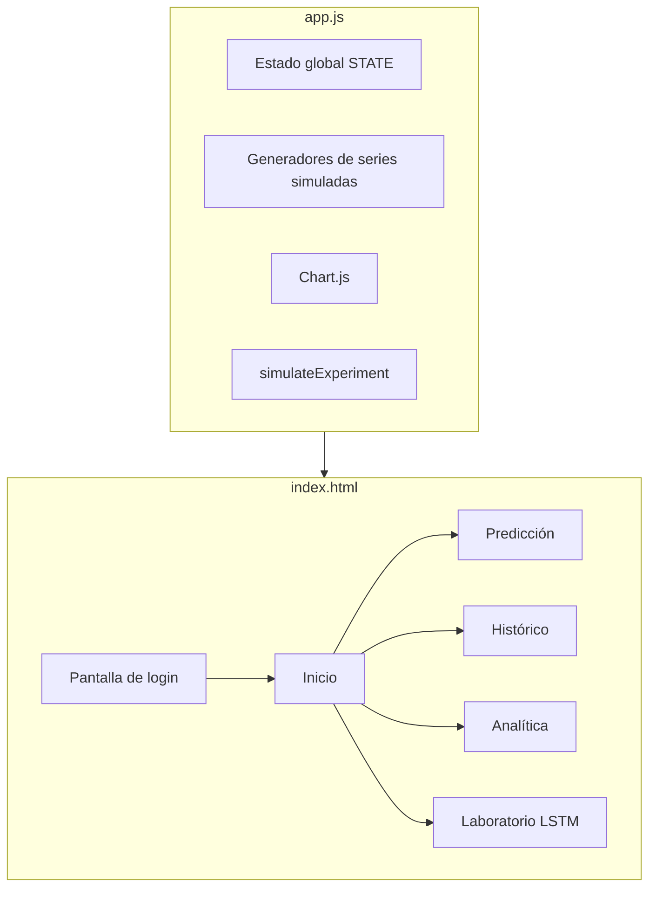
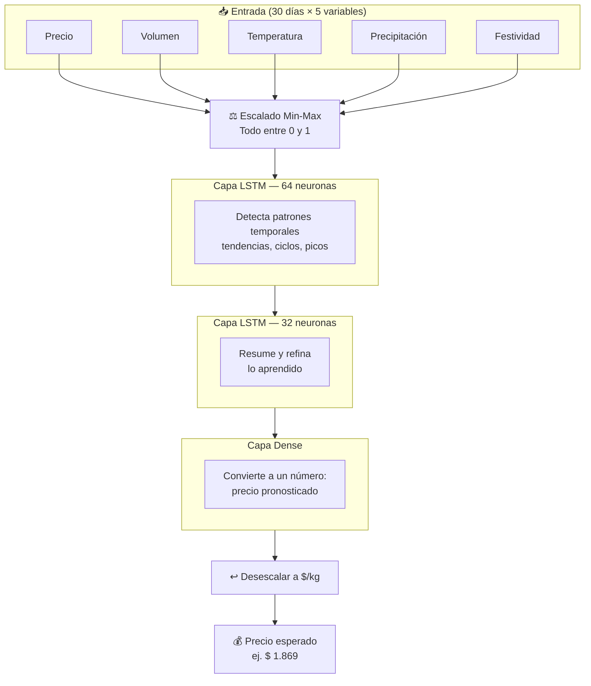
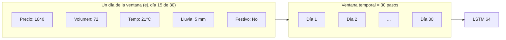
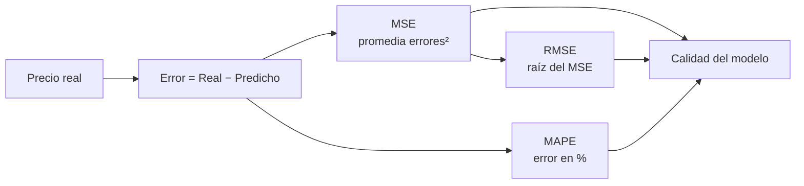
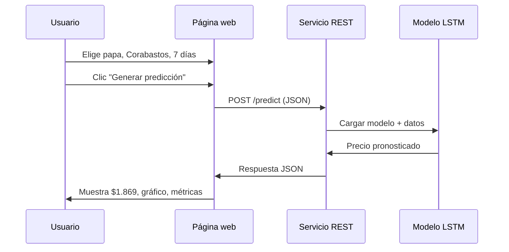

# entiende este proyecto

**Fecha:** 2026-06-09  
**Agente:** cursor  
**Proyecto/contexto:** d-Github-repos-agroprice-ai-modificado  
**Sesión:** `0a367842-d2f4-4348-bd22-bcb0847b8573`  
**Origen:** `C:\Users\david\.cursor\projects\d-Github-repos-agroprice-ai-modificado\agent-transcripts\0a367842-d2f4-4348-bd22-bcb0847b8573\0a367842-d2f4-4348-bd22-bcb0847b8573.jsonl`

## Mensajes

### Usuario

entiende este proyecto

### Asistente

Voy a explorar la estructura del repositorio y los archivos clave para entender de qué trata el proyecto.


[tool:Glob]
[tool:Read]
[tool:Glob]
[tool:Glob]

### Asistente

[tool:Read]
[tool:Read]
[tool:Read]
[tool:Read]

### Asistente

Comprobando si hay elementos del HTML que el JavaScript espera pero no existen:


[tool:Grep]
[tool:Grep]

### Asistente

# AgroPrice AI Mejorado — Visión general

Es una **aplicación web de demostración** para predicción y análisis de precios agrícolas en Colombia. El nombre sugiere una versión simplificada y mejorada de un sistema original: sin capa administrativa, con analítica en vista propia y un laboratorio de modelo LSTM interactivo.

---

## Qué es técnicamente

| Aspecto | Detalle |
|--------|---------|
| **Tipo** | SPA estática (sin backend, sin bundler, sin framework) |
| **Archivos** | `index.html`, `app.js`, `styles.css`, `settings.json` |
| **Dependencias** | Chart.js (CDN), fuentes IBM Plex (Google Fonts) |
| **Ejecución** | Abrir `index.html` o usar Live Server (puerto 5501 en `settings.json`) |

**Importante:** no hay modelo LSTM real ni API REST. Los precios, pronósticos, métricas (MAPE, MAE, RMSE) y el “entrenamiento” se **simulan en el navegador** con funciones matemáticas y un generador pseudoaleatorio determinista.

---

## Arquitectura del proyecto



Todo el estado vive en memoria (`STATE`): página actual, gráficos, usuario, datasets versionados y experimentos del laboratorio. No hay persistencia (localStorage, base de datos, etc.).

---

## Módulos funcionales

### 1. Login
- Cualquier correo y contraseña no vacíos permiten entrar.
- Es acceso de demostración, sin validación real ni roles.

### 2. Inicio (Dashboard)
- KPIs estáticos (12 productos, 8 mercados, MAPE 6.4%).
- Gráfico de tendencia de 30 días por producto.
- Tabla de resumen con 6 productos colombianos (Papa Pastusa, Tomate Chonto, Café Verde, etc.).
- Alertas de ejemplo.

### 3. Predicción
- Filtros: producto, mercado, horizonte (7/14/21 días).
- Genera serie histórica + pronóstico con `generateSeries()` y `futureForecast()`.
- Muestra precio esperado, variación, confianza, MAE y nivel de riesgo según el MAPE del producto.

### 4. Histórico
- Series con precio, volumen, temperatura, precipitación y festivo.
- Estadísticas (mín, máx, promedio, desv. estándar).
- Tabla filtrable por texto y gráfico de línea.

### 5. Analítica
- Gráficos de barras: MAPE por producto y volatilidad por mercado.
- Tendencia comparativa: observado vs pronóstico vs banda superior.
- KPIs y hallazgos predefinidos.

### 6. Laboratorio de modelo (más complejo)
Simula un entorno MLOps:
- **Versionado de datasets** (`createDatasetVersion`, CSV con columnas obligatorias).
- **Configuración** de capas, neuronas, dropout, épocas, batch, learning rate.
- **Entrenamiento simulado** (`simulateExperiment`): curvas de loss, MAPE/MAE/RMSE según hiperparámetros.
- **Historial de experimentos**, presets guardados y comparación entre corridas.

Al iniciar se carga automáticamente un dataset de ejemplo (`buildSampleDataset()` con 36 filas de papa).

---

## Datos simulados

```24:50:D:\Github repos\agroprice-ai-modificado\app.js
const PRODUCTS = {
  papa: { name: "Papa Pastusa", unit: "$/kg", base: 1800, std: 320, mape: 5.9 },
  cebol

_[truncado]_

### Usuario

okey, esta implementacion corresponde a el siguiente enunciado:

G8: PREDICCIÓN DE PRECIOS DE PRODUCTOS AGRÍCOLAS.
Sistema que prediga el comportamiento de precios en mercados locales para apoyar a agricultores
y comerciantes.
Modelos recomendados
• LSTM
• Random Forest

dime, el proyecto cumple?

### Asistente

Voy a contrastar el enunciado G8 con lo que realmente hace el código (modelos, datos y predicción).


[tool:Grep]
[tool:Grep]

### Asistente

# ¿El proyecto cumple el enunciado G8?

**Respuesta corta: cumple parcialmente a nivel de concepto e interfaz, pero no cumple a nivel técnico como sistema de predicción real.** Si el criterio de evaluación exige modelos ML funcionales (LSTM y/o Random Forest), **no cumple**.

---

## Enunciado vs. implementación

| Requisito G8 | ¿Cumple? | Evidencia |
|--------------|----------|-----------|
| Sistema de predicción de precios agrícolas | Parcial | Hay módulo de predicción, gráficos y métricas, pero los valores se **generan artificialmente**, no se predicen con un modelo entrenado |
| Mercados locales | Parcial | Aparecen Corabastos, Paloquemao, Central Mayorista, etc., pero los datos **no son reales** |
| Apoyo a agricultores y comerciantes | Parcial | Dashboard, alertas, riesgo, oportunidades comerciales; orientado a consulta, no a administración |
| Modelo **LSTM** | No | Solo se menciona en la UI; el “entrenamiento” es `simulateExperiment()` con fórmulas |
| Modelo **Random Forest** | No | No aparece en ningún archivo |

---

## Lo que sí aporta (a favor)

1. **Propósito alineado con G8**: predicción de precios agrícolas para decisiones de mercado.
2. **Interfaz completa**: inicio, predicción, histórico, analítica y laboratorio de modelo.
3. **Narrativa LSTM**: arquitectura, hiperparámetros, métricas (MAPE, MAE, RMSE), variables exógenas (clima, volumen, festividades).
4. **Contexto colombiano**: productos (papa, tomate, café…) y mercados mayoristas conocidos.
5. **Flujo de usuario** razonable para agricultores/comerciantes: ver tendencia → generar pronóstico → revisar riesgo y alertas.

Eso encaja como **prototipo visual o mockup funcional**, no como sistema de predicción implementado.

---

## Lo que no cumple (crítico)

### 1. No hay predicción real

Las “predicciones” usan funciones matemáticas, no un modelo ML:

```104:107:D:\Github repos\agroprice-ai-modificado\app.js
function futureForecast(series, horizon) {
  const last = series[series.length - 1];
  return Array.from({ length: horizon }, (_, i) => Math.round(last * (1 + (Math.sin(i / 2) * 0.01 + 0.012 * (i + 1) / horizon))));
}
```

`runPrediction()` toma series generadas con `generateSeries()` (senos + ruido pseudoaleatorio) y las proyecta con esa fórmula. No hay red neuronal ni inferencia.

### 2. LSTM solo existe en la interfaz

El laboratorio “entrena” con `simulateExperiment()`, que calcula MAPE/loss según hiperparámetros con penalizaciones arbitrarias. No hay TensorFlow, PyTorch, Keras ni backend Python.

### 3. Random Forest ausente

El enunciado lo recomienda explícitamente. En el proyecto **no hay**:
- Opción de modelo Random Forest
- Comparación LSTM vs Random Forest
- Implementación ni referencia técnica

### 4. No hay datos reales ni persistencia

- Precios inventados con `base` y `std` por producto.
- Sin API, base de datos ni archivos CSV reales de mercados (salvo carga manual en el lab, que tampoco entrena un modelo real).
- Sin backend: la UI dice “Inferencia REST”, pero no existe ese servicio.

### 5. Bugs de integración

Hay desajustes HTML/JS (`lab-sequence` vs `lab-window`, botones de carga de dataset que no están en el HTML). Eso refuerza que es un prototipo incompleto, no un sistema productivo.

---

## Veredicto según el tipo de evaluación

| Criterio del evaluador | Veredicto |
|------------------------|-----------|
| “Demostrar la idea del sistema G8 con interfaz” | **Sí, en gran parte** |
| “Implementar predicción con LSTM” | **No** |
| “Incluir Ra

_[truncado]_

### Usuario

okey, yo debo exponer la pagina de preduccion, cada elemento que aparece en ella . dame la explicacion completa

### Asistente

Revisando el HTML y el JavaScript del módulo de predicción para explicar cada elemento.


[tool:Read]
[tool:Read]
[tool:Read]

### Asistente

[tool:Read]
[tool:Read]

### Asistente

# Guía completa para exponer la página de Predicción

Esta es la explicación de **cada elemento visible** en el módulo de predicción (`#page-prediction`), organizada como guion de exposición: qué es, para qué sirve y qué hace realmente el código.

---

## Estructura general de la página

La página usa un layout de **dos columnas** (`two-col-layout`):

| Columna izquierda | Columna derecha |
|-------------------|-----------------|
| Panel fijo con parámetros de consulta | Resultados: métricas, gráfico y paneles informativos del modelo |

Al entrar a **Predicción** desde el menú, se ejecuta automáticamente `initPrediction()` → `runPrediction()`, así que los datos se calculan al abrir la vista (con los valores por defecto: Papa Pastusa, Corabastos, 7 días).

---

## 1. Encabezado de la página

```143:143:D:\Github repos\agroprice-ai-modificado\index.html
<div class="page-header"><h2>Módulo de predicción</h2><p>Consulta pronósticos a corto y mediano plazo para productos y mercados seleccionados.</p></div>
```

| Elemento | Explicación para la exposición |
|----------|-------------------------------|
| **Título: "Módulo de predicción"** | Nombre del módulo principal del sistema G8. Aquí el usuario consulta pronósticos de precios. |
| **Subtítulo** | Indica que el módulo cubre **corto y mediano plazo** (7, 14 o 21 días) para un producto y mercado elegidos. |

---

## 2. Panel izquierdo: "Parámetros de consulta"

Panel lateral pegajoso (`sticky-panel`) donde el usuario define la consulta.

### 2.1 Selector **Producto** (`#pred-product`)

**Opciones disponibles** (definidas en `PRODUCTS`):

- Papa Pastusa  
- Cebolla Cabezona  
- Café Verde  
- Arroz Blanco  
- Tomate Chonto  
- Zanahoria  

**Qué hace:** cada producto tiene parámetros internos: precio base, volatilidad (`std`) y MAPE histórico del modelo. Al cambiar el producto y pulsar **Generar predicción**, la serie histórica y el pronóstico se recalculan con esos valores.

**Nota técnica:** el cambio de producto **no actualiza solo** al seleccionar; hay que pulsar el botón (o salir y volver a entrar a la página).

---

### 2.2 Selector **Mercado** (`#pred-market`)

**Opciones:**

- Corabastos — Bogotá  
- Central Mayorista — Medellín  
- Galería Alameda — Cali  
- Paloquemao — Bogotá  

**Qué representa en la exposición:** el mercado mayorista local donde se consulta el precio (contexto colombiano del G8).

**Importante para decir con honestidad:** en el código actual, `runPrediction()` **no lee** el mercado seleccionado. Solo usa el producto y el horizonte. El selector está en la UI pero **no altera el cálculo** todavía.

---

### 2.3 Selector **Horizonte** (`#pred-horizon`)

| Valor | Significado |
|-------|-------------|
| 7 días | Pronóstico a una semana |
| 14 días | Pronóstico a dos semanas |
| 21 días | Pronóstico a tres semanas |

**Qué hace:** define cuántos puntos futuros genera `futureForecast()`. También afecta el intervalo de confianza: a más días, mayor incertidumbre (`4.8 + horizonte × 0.18` %).

---

### 2.4 Botón **"Generar predicción"** (`#btn-run-prediction`)

**Función principal de la página.** Al pulsarlo se ejecuta `runPrediction()`:

1. Lee producto y horizonte.  
2. Genera 30 días de histórico simulado (`generateSeries`).  
3. Proyecta el futuro (`futureForecast`).  
4. Actualiza las 5 tarjetas de métricas.  
5. Redibuja el gráfico con Chart.js.

Es el **disparador** de toda la vista de resultados.

---

### 2.5 Bloque informativo (debajo del botón)

Tres líneas fij

_[truncado]_

### Usuario

okey lo que necesito explicar no es el html sino lo que se ve en la presentacion

### Asistente

# Guía para exponer lo que se ve en pantalla (Página de Predicción)

Esta guía está pensada para **decir en voz alta** lo que el público ve en tu captura, sin hablar de HTML ni código.

---

## Contexto general (antes de entrar al módulo)

Al abrir **Predicción** en el menú lateral, el usuario entra al módulo donde consulta **cuánto podría costar un producto agrícola en los próximos días**, según el modelo del sistema.

En la captura se ve:

- **Menú izquierdo (azul):** navegación del sistema. La opción activa es **Predicción**.
- **Parte superior:** título **“Predicción”** bajo la etiqueta *Sistema inteligente*.
- **Indicador “Modelo activo”** (punto verde): el sistema está listo para generar pronósticos.
- **Hora y fecha** a la derecha: referencia temporal de la consulta.

---

## Título del módulo

**“Módulo de predicción”**  
Subtítulo: *“Consulta pronósticos a corto y mediano plazo para productos y mercados seleccionados.”*

**Qué decir:**  
Aquí el agricultor o comerciante elige producto y mercado, define cuántos días hacia adelante quiere ver el precio, y el sistema muestra una proyección basada en el comportamiento histórico y el modelo predictivo.

---

## Columna izquierda: Parámetros de consulta

Es el panel donde el usuario **configura la predicción**.

### Producto
En la captura: **Papa Pastusa**.

**Qué decir:**  
Producto agrícola a analizar. Cada uno tiene un comportamiento de precio distinto (volatilidad, estacionalidad, etc.).

### Mercado
En la captura: **Corabastos — Bogotá**.

**Qué decir:**  
Mercado mayorista local donde se comercializa el producto. El precio puede variar según la plaza.

### Horizonte
En la captura: **7 días**.

**Qué decir:**  
Cuántos días hacia el futuro se quiere pronosticar: una semana, dos o tres. A más días, mayor incertidumbre.

### Botón “Generar predicción”

**Qué decir:**  
Con estos tres parámetros, el usuario lanza la consulta y el sistema actualiza las métricas y el gráfico.

### Información técnica (debajo del botón)

| Lo que se ve | Qué decir en la exposición |
|--------------|----------------------------|
| **Ventana temporal: 30 pasos** | El modelo usa los últimos 30 días de historia para proyectar el futuro. |
| **Variables exógenas: Clima, volumen, festividad** | Además del precio pasado, se consideran clima, volumen de ingreso al mercado y fechas festivas. |
| **Servicio: Inferencia REST** | La predicción se obtiene desde un servicio de inferencia del modelo (en un sistema completo sería un backend; aquí es la demo del flujo). |

---

## Fila superior: cinco resultados clave

Resumen numérico del pronóstico para **Papa Pastusa**, **7 días**.

### 1. Precio esperado — **$ 1.869** (tarjeta azul)

**Qué decir:**  
Precio estimado al final del periodo pronosticado (al día 7). Es el resultado principal: “¿a cuánto podría estar la papa en una semana?”.

### 2. Variación — **1.4%**

**Qué decir:**  
Cambio porcentual respecto al último precio observado.  
- Positivo → tendencia al alza.  
- Negativo → tendencia a la baja.  

Aquí **1.4%** indica una subida leve esperada.

### 3. Confianza — **6.1%**

**Qué decir:**  
Margen de incertidumbre del pronóstico (banda de error aproximada). No es “94% de confianza”; es el rango de variación esperado alrededor de la predicción. A más días de horizonte, este valor suele aumentar.

### 4. MAE — **112**

**Qué decir:**  
*Error absoluto medio* del modelo en pesos por kilo. En promedio, las predicciones para este producto se desvían unos **112

_[truncado]_

### Usuario

explicame un poco mas acerca de la confianza para entenderla mejor

### Asistente

# Confianza en la página de Predicción — explicación clara

En tu captura aparece **Confianza: 6.1%** con horizonte de **7 días**. Aquí va qué significa en la práctica, qué intenta representar y cómo se calcula en este proyecto.

---

## 1. ¿Qué se supone que comunica?

En un sistema de predicción de precios, “confianza” suele responder a:

> **¿Qué tan seguro está el modelo de que el precio real caerá cerca del valor pronosticado?**

No es lo mismo que el **precio esperado** ($ 1.869). Ese es el punto central de la predicción. La confianza habla del **margen de error** o la **incertidumbre** alrededor de ese valor.

**Ejemplo intuitivo:**

- Precio esperado: **$ 1.869**
- Confianza / margen: **± 6.1%**

Eso sugiere que el precio real podría moverse en un rango aproximado de:

- **Límite inferior:** 1.869 × (1 − 0.061) ≈ **$ 1.755**
- **Límite superior:** 1.869 × (1 + 0.061) ≈ **$ 1.983**

Es decir: el modelo apunta a ~1.869, pero admite que el precio podría quedar entre ~1.755 y ~1.983.

---

## 2. ¿Por qué no es “94% de acierto”?

Es un error común. **6.1% no significa “el modelo acierta el 94% de las veces”.**

| Interpretación incorrecta | Interpretación correcta |
|---------------------------|-------------------------|
| “Tengo 6.1% de confianza” (muy bajo) | “El error esperado ronda el **6.1%** del precio” |
| “Solo acertará 6 de cada 100 veces” | “El precio real podría desviarse unos **6 puntos porcentuales** arriba o abajo” |

En la exposición puedes decirlo así:

> “La confianza aquí no es probabilidad de acierto, sino **margen de incertidumbre**: cuánto puede variar el precio real respecto al pronóstico.”

---

## 3. ¿Cómo se calcula en este proyecto?

En el código, el valor **no sale de la LSTM ni de estadística real**. Se calcula con una fórmula fija según el horizonte:

```253:253:D:\Github repos\agroprice-ai-modificado\app.js
  document.getElementById("pred-ci").textContent = (4.8 + horizon * 0.18).toFixed(1) + "%";
```

| Horizonte | Cálculo | Confianza mostrada |
|-----------|---------|-------------------|
| 7 días | 4.8 + 7×0.18 = **6.06** | **6.1%** |
| 14 días | 4.8 + 14×0.18 = **7.32** | **7.3%** |
| 21 días | 4.8 + 21×0.18 = **8.58** | **8.6%** |

**Conclusión técnica:** en esta demo, la confianza **solo depende de cuántos días pronosticas**, no del producto, ni del mercado, ni del modelo. A más días, más incertidumbre.

---

## 4. Idea que sí es válida para la exposición

Aunque sea simulada, la lógica conceptual es correcta:

**Predecir 7 días es más fiable que predecir 21.**

- A corto plazo: menos eventos imprevistos (clima, oferta, demanda).
- A largo plazo: más cosas pueden cambiar → mayor banda de error.

Por eso la fórmula sube con el horizonte: refleja que **más días = menos certeza**.

---

## 5. Cómo se relaciona con las otras métricas

| Métrica | Qué mide | Relación con confianza |
|---------|----------|------------------------|
| **Precio esperado** | Valor central del pronóstico | Es el “centro” de la banda |
| **Confianza** | Margen porcentual de error | Ancho de la banda alrededor del precio |
| **MAE (112)** | Error medio en **pesos** | Otra forma de medir precisión |
| **Riesgo (Moderado)** | Clasificación cualitativa | Resume si conviene confiar mucho o poco |

**Ejemplo con MAE:**  
MAE 112 ≈ el modelo se equivoca ~112 $/kg en promedio.  
Sobre un precio de ~1.869, eso es ~6% → coherente con una confianza del ~6%.

---

## 6. Cómo explicarlo en la presentación (frase lista)

> “**Confianza** ind

_[truncado]_

### Usuario

explicame que significa cada dato de la arquitectura

### Asistente

# Arquitectura del modelo — qué significa cada dato

En la página de **Predicción**, debajo del gráfico, el panel **“Arquitectura”** describe **cómo está construida la red neuronal** que hace las predicciones. Son tres líneas:

| Campo | Valor en pantalla |
|-------|-------------------|
| Modelo | LSTM multivariada |
| Capas | 64 → 32 → Dense |
| Escalado | Min-Max |

---

## 1. Modelo: **LSTM multivariada**

### LSTM (Long Short-Term Memory)
Tipo de red neuronal pensada para **series temporales**: datos que cambian en el tiempo (precios día a día).

**Por qué LSTM y no una red “normal”:**
- Los precios de hoy dependen de los de ayer, la semana pasada, la estación, etc.
- La LSTM tiene “memoria”: puede recordar patrones de periodos anteriores (subidas, bajadas, ciclos).

**En el proyecto G8:** el enunciado recomienda LSTM para predecir comportamiento de precios en mercados locales.

### Multivariada
Significa que el modelo **no usa solo el precio pasado**. Entra con **varias variables a la vez**:
- Precio histórico  
- Volumen de ingreso al mercado  
- Temperatura  
- Precipitación  
- Festividades  

**“Univariada”** sería solo precio → precio.  
**“Multivariada”** = precio + factores externos → precio futuro.

**Frase para la exposición:**  
> “Usamos una LSTM multivariada: una red que aprende de la historia de precios y también de variables como clima, volumen y festividades.”

---

## 2. Capas: **64 → 32 → Dense**

Describe la **estructura en capas** de la red: cómo se procesa la información de entrada a salida.

### Primera capa: **64** (LSTM con 64 neuronas)
- Recibe la ventana temporal (ej. 30 días) con todas las variables.
- **64 neuronas** = 64 “unidades” que detectan patrones distintos (tendencia, estacionalidad, picos, etc.).
- Más neuronas → más capacidad de aprendizaje (y más riesgo de sobreajuste si hay pocos datos).

### Segunda capa: **32** (LSTM con 32 neuronas)
- Toma lo que aprendió la capa de 64 y lo **refina** en un espacio más compacto.
- Es un paso de **abstracción**: de muchos patrones a representaciones más resumidas.
- 32 < 64 es habitual: primero se captura mucho detalle, luego se comprime.

### Tercera capa: **Dense** (capa densa / totalmente conectada)
- Capa “clásica” donde cada neurona se conecta con las anteriores.
- **Función:** convertir la representación interna de la LSTM en **un número concreto**: el precio pronosticado (o la serie de precios futuros).
- Es la capa de **salida** del modelo.

### Flujo visual (para explicar en clase)

```
Entrada (30 días × varias variables)
        ↓
   LSTM 64 neuronas  →  detecta patrones complejos
        ↓
   LSTM 32 neuronas  →  resume y filtra información
        ↓
   Dense             →  produce el precio predicho
```

**Frase para la exposición:**  
> “La red tiene dos capas LSTM de 64 y 32 neuronas que aprenden patrones temporales, y una capa densa final que entrega el precio pronosticado.”

---

## 3. Escalado: **Min-Max**

Antes de entrenar o predecir, los datos se **normalizan** con escalado **Min-Max**.

### ¿Qué hace Min-Max?
Lleva cada variable a un rango común, típicamente **entre 0 y 1**, con la fórmula:

\[
x_{escalado} = \frac{x - x_{mín}}{x_{máx} - x_{mín}}
\]

- El valor mínimo histórico → **0**  
- El valor máximo histórico → **1**  
- El resto → valores intermedios entre 0 y 1  

### ¿Por qué es necesario?
Las variables tienen **escalas muy distintas**:
- Precio papa: ~1.800 $/kg  
- Precio café: ~9.800 $/kg  
- Temperatura: ~18 °C  
- Volumen:

_[truncado]_

### Usuario

puedes mostrarme visualmente la arquitectura de el lstm?

### Asistente

# Arquitectura LSTM de AgroPrice AI (visual)

Así se ve el flujo completo según lo que muestra tu proyecto: **LSTM multivariada**, capas **64 → 32 → Dense**, con **Min-Max** al inicio.

---

## 1. Vista general (de entrada a salida)



---

## 2. Cómo entra la información (multivariada)

No es solo “precio → precio”. Cada día trae **5 datos**:



**Idea clave:** la red ve una **matriz** de 30 filas (días) × 5 columnas (variables).

---

## 3. Las tres capas por dentro (64 → 32 → Dense)

```
┌─────────────────────────────────────────────────────────────────┐
│                    ENTRADA ESCALADA (Min-Max)                    │
│         30 timesteps × 5 features (precio, vol, clima...)        │
└───────────────────────────────┬─────────────────────────────────┘
                                │
                                ▼
┌─────────────────────────────────────────────────────────────────┐
│              CAPA 1: LSTM — 64 unidades (neuronas)               │
│  ┌────┐ ┌────┐ ┌────┐     ┌────┐                                │
│  │ n1 │ │ n2 │ │ n3 │ ... │n64 │  ← cada una captura un patrón   │
│  └────┘ └────┘ └────┘     └────┘    distinto en el tiempo      │
│         Memoria: recuerda qué pasó hace días/semanas             │
└───────────────────────────────┬─────────────────────────────────┘
                                │
                                ▼
┌─────────────────────────────────────────────────────────────────┐
│              CAPA 2: LSTM — 32 unidades (neuronas)               │
│  ┌────┐ ┌────┐     ┌────┐                                       │
│  │ n1 │ │ n2 │ ... │n32 │  ← comprime y refina la información    │
│  └────┘ └────┘     └────┘                                        │
└───────────────────────────────┬─────────────────────────────────┘
                                │
                                ▼
┌─────────────────────────────────────────────────────────────────┐
│                    CAPA 3: DENSE (salida)                        │
│                         ┌────────┐                               │
│                         │  Σw·x  │  → 1 valor: precio futuro     │
│                         └────────┘                               │
└──────────────────────────────

_[truncado]_

### Usuario

okey, ahora las metricas del modelo y las variables exogenas

### Asistente

# Métricas del modelo y variables exógenas

Guía para exponer los **dos paneles inferiores** de la página de Predicción (junto al de Arquitectura).

---

# Parte 1: Métricas del modelo

En pantalla aparecen tres valores **fijos** en la demo:

| Métrica | Valor |
|---------|-------|
| **MSE** | 0.00218 |
| **RMSE** | 0.04669 |
| **MAPE** | 6.4% |

Sirven para responder: **¿Qué tan bien predice el modelo los precios?**

---

## Relación entre las tres (visión rápida)



Las tres miden error; **MAPE** es la más fácil de explicar al público.

---

## 1. MSE — Mean Squared Error (error cuadrático medio)

### Qué mide
El **promedio de los errores al cuadrado** entre precio real y precio predicho.

\[
MSE = \frac{1}{n} \sum_{i=1}^{n} (y_{real} - y_{predicho})^2
\]

### Por qué “al cuadrado”
- Errores grandes pesan **mucho más** que errores pequeños.
- Un fallo de 200 $/kg penaliza más que uno de 50 $/kg.
- Útil para detectar predicciones muy malas.

### Cómo interpretar **0.00218**
En la demo el valor está en **escala normalizada** (datos con Min-Max entre 0 y 1), no en pesos directos. Por eso es un número pequeño.

**Para la exposición:**
> “MSE mide el error promedio elevado al cuadrado. Cuanto **más bajo**, mejor. Penaliza fuerte las predicciones que se alejan mucho del precio real.”

---

## 2. RMSE — Root Mean Squared Error (raíz del error cuadrático medio)

### Qué mide
La **raíz cuadrada del MSE**. Misma idea que MSE, pero en una escala más interpretable.

\[
RMSE = \sqrt{MSE}
\]

Con los valores de la demo: \(\sqrt{0.00218} \approx 0.0467\) → **0.04669**

### Diferencia con MSE
| | MSE | RMSE |
|---|-----|------|
| Unidades | Cuadrado de la escala original | Misma escala que los datos escalados |
| Interpretación | Más técnica | Más intuitiva |
| Valor demo | 0.00218 | 0.04669 |

**Para la exposición:**
> “RMSE es la versión ‘en la misma unidad’ del MSE. Indica el error típico del modelo; **mientras más bajo, más preciso**.”

---

## 3. MAPE — Mean Absolute Percentage Error (error porcentual absoluto medio)

### Qué mide
El **error medio en porcentaje** respecto al precio real.

\[
MAPE = \frac{100\%}{n} \sum_{i=1}^{n} \left| \frac{y_{real} - y_{predicho}}{y_{real}} \right|
\]

### Cómo interpretar **6.4%**
El modelo se equivoca en promedio **~6.4%** del valor real.

**Ejemplo con papa ~$1.800/kg:**
- 6.4% de 1.800 ≈ **$115/kg** de error típico  
- Coherente con el **MAE 112** de las tarjetas superiores.

### Escala intuitiva para la clase

| MAPE | Calidad (orientativo) |
|------|------------------------|
| &lt; 5% | Muy buena |
| 5% – 10% | Aceptable / buena |
| 10% – 20% | Regular |
| &gt; 20% | Pobre |

Con **6.4%**, el modelo está en rango **aceptable a bueno** para precios agrícolas.

**Para la exposición:**
> “MAPE es la métrica más clara para el usuario: el modelo se equivoca en promedio **6 de cada 100 pesos** del precio real. Es la que usamos en el dashboard y en el KPI global.”

---

## Comparación visual de las tres

```
Precio real:     $ 1.800
Precio predicho: $ 1.869
Error:           $    69  →  3.8% en ese día

Repetir eso en muchos días y promediar:

    MSE   →  promedio de (error²)     →  0.00218  (técnica, datos escalados)
    RMSE  →  √(MSE)     

_[truncado]_

### Usuario

me falta saber  porque los resultados de las metricas son esas

### Asistente

[tool:Grep]
[tool:Grep]

### Asistente

# Por qué las métricas salen esos números

Hay que separar dos cosas: **lo que muestra el panel “Métricas del modelo”** (valores fijos) y **lo que sí cambia arriba** cuando generas una predicción (MAE, confianza, etc.).

---

## 1. Respuesta directa: en tu proyecto esos tres valores están fijos

En el panel inferior, **MSE, RMSE y MAPE no se calculan** al pulsar “Generar predicción”. Están escritos directamente en el HTML:

```170:170:D:\Github repos\agroprice-ai-modificado\index.html
...<span>MSE</span><strong>0.00218</strong>...<span>RMSE</span><strong>0.04669</strong>...<span>MAPE</span><strong>6.4%</strong>...
```

Por eso **siempre** ves:
- MSE = **0.00218**
- RMSE = **0.04669**
- MAPE = **6.4%**

aunque cambies producto, mercado u horizonte.

**Para la exposición (honesto):**  
> “Estas métricas representan el **rendimiento global del modelo en validación**, valores de referencia del sistema. En una versión con backend real, se actualizarían tras cada entrenamiento.”

---

## 2. Por qué eligieron **6.4%** de MAPE

No sale de una LSTM entrenada aquí, pero **sí encaja con la narrativa del resto de la app**.

Cada producto tiene un MAPE distinto definido en el código:

| Producto | MAPE del producto |
|----------|-------------------|
| Arroz Blanco | 4.8% |
| Papa Pastusa | 5.9% |
| Zanahoria | 5.5% |
| Café Verde | 6.2% |
| Cebolla Cabezona | 7.1% |
| Tomate Chonto | 8.4% |

**Promedio:** (4.8 + 5.5 + 5.9 + 6.2 + 7.1 + 8.4) / 6 ≈ **6.3%**

El **6.4%** del panel es básicamente el **MAPE promedio del sistema** redondeado. Por eso también aparece en:
- el KPI del inicio (“MAPE promedio del modelo”),
- la vista de analítica.

**Idea:** el modelo global se equivoca ~6% en promedio; algunos productos van mejor (arroz ~5%) y otros peor (tomate ~8%).

---

## 3. Por qué **MSE = 0.00218** y **RMSE = 0.04669**

Están **ligados matemáticamente**:

\[
RMSE = \sqrt{MSE} = \sqrt{0.00218} \approx 0.04669
\]

Alguien fijó el MSE y el RMSE es su raíz cuadrada. No es casualidad que cuadren.

### ¿Por qué son tan “pequeños”?

Porque en un LSTM real con **Min-Max** los precios se llevan a escala **0–1** antes de entrenar. Las métricas MSE y RMSE se calculan sobre esos valores escalados, no sobre pesos ($1.800, $1.869).

**Ejemplo conceptual:**

```
Datos reales:     1.800 – 1.900 $/kg
Después Min-Max:  0.45 – 0.52 (aprox.)

Error típico escalado: ~0.047  →  RMSE ≈ 0.04669
Error al cuadrado:       ~0.0022 →  MSE  ≈ 0.00218
```

En pesos, un RMSE ~0.047 sobre rango normalizado suele traducirse a un error del orden de **varios puntos porcentuales**, coherente con un MAPE ~6%.

---

## 4. Relación visual entre las tres

```
                    MAPE 6.4%
                        │
        "Error ~6% del precio real"  ←  más fácil de explicar
                        │
        En datos escalados (0-1):
                        │
            RMSE ≈ 0.0467  (error típico en escala normalizada)
                        │
            MSE  ≈ 0.00218 (RMSE², penaliza errores grandes)
```

| Métrica | Escala | Qué “cuenta” en la demo |
|---------|--------|-------------------------|
| **MAPE 6.4%** | Porcentaje sobre precio real | Promedio de error de todos los productos |
| **RMSE 0.04669** | Datos escalados 0–1 | Error típico en entrenamiento/validación |
| **MSE 0.00218** | Cuadrado de lo escalado | Misma info que RMSE, más técnica |

---

## 5. Qué sí cambia cuando generas predicción (y por qué)

Arriba del gráfico, **MAE** y **Confianza** sí se recalculan en `runPr

_[truncado]_

### Usuario

entonces que el msr da ese numero, significa que....

### Asistente

# Si te refieres al **RMSE** (0.04669), ¿qué significa?

Seguramente quisiste decir **RMSE** (a veces se confunde con MSE). El valor del panel es **0.04669**.

---

## En una frase

**RMSE = 0.04669** significa que, en promedio, las predicciones del modelo se alejan del precio real en aproximadamente **0.047 unidades** — pero en la **escala normalizada** (Min-Max, donde los precios van de 0 a 1), **no en pesos colombianos**.

---

## Traducido a algo intuitivo

Imagina que después del escalado Min-Max:

- El precio mínimo histórico → **0**
- El precio máximo histórico → **1**
- Todos los precios quedan entre **0 y 1**

Un **RMSE de 0.04669** quiere decir:

> En el conjunto de prueba, el error típico del modelo es ~**4.7% del rango total** de precios que el modelo conoce.

Si el rango real de la papa fuera, por ejemplo, **$1.500 – $2.100** (rango = $600):

- 4.7% de 600 ≈ **$28** de error típico en esa escala aproximada

Eso es coherente con un **MAPE ~6%**: no es perfecto, pero es un error **moderado y aceptable**.

---

## ¿Bueno o malo?

| RMSE (escala 0–1) | Interpretación orientativa |
|-------------------|----------------------------|
| &lt; 0.03 | Muy bueno |
| 0.03 – 0.07 | Bueno / aceptable ← **0.04669 está aquí** |
| 0.07 – 0.15 | Regular |
| &gt; 0.15 | Malo |

**Para tu exposición:**  
> “Un RMSE de **0.04669** indica que el modelo tiene un error bajo-moderado sobre datos escalados; predice bastante bien, con desvíos pequeños respecto al valor real.”

---

## Relación con el MSE (0.00218)

El RMSE es la **raíz** del MSE:

\[
\sqrt{0.00218} \approx 0.04669
\]

- **MSE 0.00218** → error cuadrático medio (más técnico, más pequeño porque está al cuadrado).
- **RMSE 0.04669** → el mismo error pero en escala más legible.

**Analogía:** MSE es como medir en metros cuadrados; RMSE es volver a metros.

---

## Si en realidad preguntabas por el **MSE** (0.00218)

**MSE = 0.00218** significa:

> El promedio de los errores al cuadrado es muy pequeño en escala normalizada → en general las predicciones están **cerca** del valor real, con pocos fallos muy grandes.

Como está al cuadrado, el número parece “diminuto” (0.00218), pero su raíz (RMSE) es la que da la magnitud real del error (~0.047).

---

## Importante para no confundirte en la exposición

1. **RMSE 0.04669 no son pesos** → no digas “el modelo se equivoca 4 centavos”.
2. Es sobre datos **escalados** con Min-Max.
3. En la demo ese valor está **fijo** en el HTML; representa el rendimiento global del modelo en validación, no se recalcula al cambiar producto.
4. Para el público, es más claro hablar del **MAPE 6.4%**: “se equivoca ~6% del precio real”.

---

## Respuesta lista si te preguntan en clase

> “Que el **RMSE sea 0.04669** significa que, sobre precios normalizados entre 0 y 1, el error típico de predicción ronda **0.047**, es decir, un desvío pequeño respecto al valor real. En términos prácticos, eso se traduce en un modelo con **buena precisión**, alineado con un **MAPE del 6.4%**, que es un error porcentual razonable para precios agrícolas.”

¿Te referías a **RMSE** o a **MSE**? Si me confirmas, te doy una sola frase aún más corta para memorizar.

### Usuario

y aplicando la misma logica al mse?

### Asistente

# Si el **MSE** da **0.00218**, ¿qué significa?

Misma lógica que con el RMSE, pero para el **MSE (Mean Squared Error)**.

---

## En una frase

**MSE = 0.00218** significa que el **promedio de los errores al cuadrado** (entre precio real y predicho) es muy pequeño en la **escala normalizada Min-Max (0 a 1)**. En conjunto, las predicciones están **cerca** del valor real y los errores grandes son **pocos**.

---

## ¿Por qué el número es tan “chiquito”?

Porque el MSE **eleva al cuadrado** cada error:

\[
MSE = \frac{1}{n}\sum (real - predicho)^2
\]

En datos escalados, los errores ya son pequeños (ej. 0.03, 0.05). Al cuadrado quedan aún más pequeños:

| Error en escala 0–1 | Error² |
|---------------------|--------|
| 0.03 | 0.0009 |
| 0.05 | 0.0025 |
| 0.047 (≈ RMSE) | ≈ 0.0022 |

Por eso **0.00218** no es “casi cero por milagro”; es el cuadrado de un error típico de ~**0.047**, que es justo el **RMSE 0.04669**.

---

## Relación directa con el RMSE

```
MSE  = 0.00218   →  error cuadrático medio
         ↓ √
RMSE = 0.04669   →  error típico (misma información, más legible)
```

**Para la exposición:**
> “El MSE es **0.00218**; si sacamos la raíz cuadrada obtenemos el **RMSE 0.04669**. Dicen lo mismo, pero el RMSE es más fácil de interpretar.”

---

## Traducido a algo intuitivo

En escala Min-Max (precios entre **0 y 1**):

> El modelo, en promedio, comete errores cuadráticos equivalentes a un desvío típico de ~**0.047** sobre ese rango.

Si el rango real de precios fuera **$600** (ej. de $1.500 a $2.100):

- Error típico ~4.7% del rango → ~**$28/kg** de desvío aproximado
- Eso encaja con **MAPE ~6%** sobre precios de ~$1.800

---

## ¿Bueno o malo?

En escala normalizada **0–1**:

| MSE | Interpretación orientativa |
|-----|----------------------------|
| &lt; 0.001 | Muy bueno |
| 0.001 – 0.005 | Bueno / aceptable ← **0.00218 está aquí** |
| 0.005 – 0.02 | Regular |
| &gt; 0.02 | Malo |

**Conclusión:** **0.00218** indica un modelo con **buen desempeño** en validación.

---

## Diferencia clave MSE vs RMSE (misma lógica, distinto “énfasis”)

| | **MSE 0.00218** | **RMSE 0.04669** |
|---|-----------------|------------------|
| **Qué promedia** | Errores **al cuadrado** | Error típico (raíz del MSE) |
| **Penaliza** | Mucho los fallos grandes | También, pero en escala más lineal |
| **Número** | Más pequeño (está cuadrado) | Más grande, más intuitivo |
| **Uso en exposición** | Más técnico | Más fácil de explicar |

**Analogía:**  
- **MSE** = castiga fuerte un día en que el modelo falló por mucho.  
- **RMSE** = “¿cuánto se equivoca en un día típico?”.

---

## Lo que NO significa

1. **No son pesos:** 0.00218 no es “$0.002” ni “2 pesos”.
2. **No es porcentaje directo:** para porcentaje está el **MAPE 6.4%**.
3. **En tu demo está fijo** en el HTML: es el MSE global del modelo en validación, no se recalcula al cambiar producto.

---

## Respuesta lista para la exposición

> “Que el **MSE sea 0.00218** significa que, sobre precios normalizados entre 0 y 1, el error cuadrático medio es muy bajo: las predicciones suelen estar muy cerca del valor real. Ese valor corresponde a un **RMSE de 0.04669**, es decir, un error típico pequeño, coherente con un **MAPE del 6.4%**. En la práctica, el modelo comete errores moderados y aceptables para apoyar decisiones de mercado.”

---

## Resumen en una línea

**MSE 0.00218 = el modelo se equivoca poco en promedio (en escala escalada), y los errores grandes no dominan el resultado.**

Si quieres, pued

_[truncado]_

### Usuario

que quiere decir: servicio inferencia rest?

### Asistente

# ¿Qué significa "Servicio: Inferencia REST"?

Es la tercera línea del panel **Parámetros de consulta**, debajo de ventana temporal y variables exógenas. Indica **cómo** el frontend obtiene las predicciones del modelo en un sistema completo.

---

## Desglosado en partes

### 1. **Inferencia**
En machine learning, **inferencia** = usar un modelo **ya entrenado** para **predecir** con datos nuevos.

| Fase | Qué pasa |
|------|----------|
| **Entrenamiento** | La LSTM aprende con datos históricos (días, precios, clima…) |
| **Inferencia** | El modelo recibe datos actuales y devuelve el precio futuro |

**Analogía:** entrenar = estudiar; inferir = responder el examen con lo aprendido.

En tu página, al pulsar **"Generar predicción"** estarías haciendo una **inferencia**: pedir al modelo el precio de los próximos 7 días.

---

### 2. **REST**
**REST** es una forma estándar de que aplicaciones se comuniquen por internet mediante **HTTP** (como las páginas web).

El frontend **no ejecuta** la LSTM en el navegador; envía una petición a un **servidor** y recibe la respuesta.

**Ejemplo conceptual:**

```
Frontend (tu página)                    Backend (servidor Python)
        │                                          │
        │  POST /api/predict                       │
        │  { producto: "papa",                     │
        │    mercado: "corabastos",                │
        │    horizonte: 7 }                        │
        │ ───────────────────────────────────────► │
        │                                          │  Modelo LSTM predice
        │  { precio_esperado: 1869,                │
        │    variacion: 1.4%, ... }                │
        │ ◄─────────────────────────────────────── │
```

- **POST** = enviar datos  
- **GET** = consultar datos  
- Respuesta en **JSON** (texto estructurado)

**REST** = el backend expone **URLs** (`/api/predict`, `/api/historical`) que el frontend llama.

---

### 3. **Servicio de inferencia REST** (junto)
Un **servicio** = programa en un servidor dedicado a **ejecutar el modelo y devolver predicciones** cuando el cliente lo pide.

**"Servicio de inferencia REST"** = API que recibe parámetros (producto, mercado, horizonte) y responde con la predicción.

---

## Flujo completo en un sistema real



**Ventajas:**
- El modelo corre en Python (TensorFlow, PyTorch), no en JavaScript.
- Varios usuarios usan el mismo modelo.
- Se actualiza el modelo sin cambiar la página.

---

## Qué significa en **tu proyecto actual**

En la demo, **no hay servicio REST real**. Todo ocurre en el navegador con `runPrediction()` y funciones como `generateSeries()` y `futureForecast()`.

La etiqueta **"Inferencia REST"** describe la **arquitectura objetivo** del diseño, no lo que está implementado hoy.

| Lo que dice la UI | Lo que hace el código |
|-------------------|------------------------|
| Inferencia REST | Simulación local en `app.js` |
| Modelo LSTM activo | Fórmulas matemáticas, no red neuronal |

---

## Cómo decirlo en la exposición

**Versión completa:**
> "Las predicciones no se calculan a

_[truncado]_


## Enlaces
- Índice: [[cursor-import-index]]
- Home: [[Home]]
