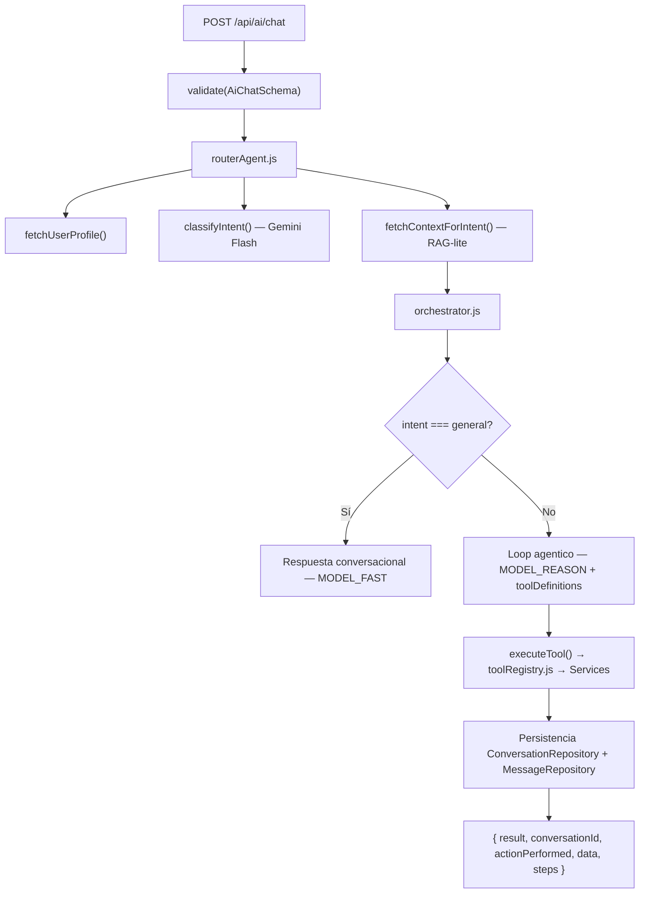

# Explore the captus-backend codebase at D:\Github repos\captus-backend to understand how th

**Fecha:** 2026-06-10  
**Agente:** cursor  
**Proyecto/contexto:** d-Github-repos-captus-backend  
**Sesión:** `0f7e57d1-d69b-4755-9be4-e252b2a34a79`  
**Origen:** `C:\Users\david\.cursor\projects\d-Github-repos-captus-backend\agent-transcripts\3240165d-fc69-4079-8abf-8d9a7724309b\subagents\0f7e57d1-d69b-4755-9be4-e252b2a34a79.jsonl`

## Mensajes

### Usuario

Explore the captus-backend codebase at D:\Github repos\captus-backend to understand how the AI agent is built. Find:
1. Main AI agent files, services, controllers, routes
2. Tools/functions available to the AI agent
3. How the agent interacts with tasks, events, diagrams, notes, statistics
4. System prompts and agent configuration

Return a comprehensive summary with file paths, key classes/functions, and what CRUD operations are supported for each entity type.

### Asistente

Voy a explorar el repositorio para localizar la arquitectura del agente de IA y sus integraciones con entidades del dominio.

[tool:UpdateCurrentStep]
[tool:Glob]
[tool:Glob]
[tool:Grep]
[tool:Glob]

### Asistente

[tool:Read]
[tool:Read]
[tool:Read]
[tool:Read]
[tool:Read]
[tool:Read]
[tool:Read]

### Asistente

Busco referencias a diagramas y reviso cómo se monta la ruta en la app.

[tool:Grep]
[tool:Grep]
[tool:Glob]
[tool:Grep]

### Asistente

[tool:Grep]
[tool:Read]
[tool:Grep]
[tool:Read]
[tool:Read]
[tool:Grep]

### Asistente

[tool:Grep]
[tool:Grep]
[tool:Grep]
[tool:Read]
[tool:Glob]

### Asistente

[tool:Read]
[tool:Grep]
[tool:Read]
[tool:Grep]

### Asistente

[tool:Read]
[tool:Read]
[tool:Grep]
[tool:Grep]

### Asistente

[tool:Grep]
[tool:Read]

### Asistente

[tool:UpdateCurrentStep]

### Asistente

# Resumen: Agente IA en captus-backend

## Arquitectura general

El agente IA vive en `D:\Github repos\captus-backend\src\ai\` y se expone vía Express en `D:\Github repos\captus-backend\src\routes\ai.js`. **No hay un controller dedicado**; la ruta maneja directamente la lógica HTTP y delega al pipeline de IA.

### Pipeline de ejecución

**Montaje en la app:** `D:\Github repos\captus-backend\src\app.js`
- Ruta: `/api/ai` con `verifySupabaseToken`
- Rate limit estricto: **30 req/min** solo en `/api/ai/chat` (vs. 200 req/min general)

---

## 1. Archivos principales

| Rol | Ruta absoluta | Clase/función clave |
|-----|---------------|---------------------|
| **Rutas HTTP** | `D:\Github repos\captus-backend\src\routes\ai.js` | Endpoints de chat y conversaciones |
| **Router (clasificación)** | `D:\Github repos\captus-backend\src\ai\routerAgent.js` | `routerAgent()`, `fetchUserProfile()` |
| **Orquestador (agentic loop)** | `D:\Github repos\captus-backend\src\ai\orchestrator.js` | `orchestrator()`, `executeTool()` loop (máx. 6 pasos) |
| **Registro de herramientas** | `D:\Github repos\captus-backend\src\ai\toolRegistry.js` | `toolRegistry`, `toolDefinitions`, `executeTool()` |
| **Contexto dinámico (RAG-lite)** | `D:\Github repos\captus-backend\src\ai\context.js` | `fetchContextForIntent()` |
| **Prompts del sistema** | `D:\Github repos\captus-backend\src\ai\prompts.js` | `buildRouterSystemPrompt()`, `buildOrchestratorSystemPrompt()`, `allowedIntents` |
| **Configuración de modelos** | `D:\Github repos\captus-backend\src\ai\model.js` | `createChatCompletion()`, `MODEL_FAST`, `MODEL_REASON`, `MODEL_STUDY` |
| **Utilidades JSON** | `D:\Github repos\captus-backend\src\ai\utils\json.js` | `extractJson()`, `normalizeToolArgs()` |
| **Validación de entrada** | `D:\Github repos\captus-backend\src\shared\schemas.js` | `AiChatSchema` (mensaje 1–4000 chars) |
| **Persistencia de chat** | `D:\Github repos\captus-backend\src\repositories\ConversationRepository.js` | CRUD de conversaciones |
| | `D:\Github repos\captus-backend\src\repositories\MessageRepository.js` | Mensajes user/bot |

### Endpoints HTTP del agente

| Método | Ruta | Descripción |
|--------|------|-------------|
| `POST` | `/api/ai/chat` | Enviar mensaje al agente |
| `GET` | `/api/ai/conversations` | Listar conversaciones del usuario |
| `GET` | `/api/ai/conversations/:id/messages` | Historial de una conversación |
| `DELETE` | `/api/ai/conversations` | Borrar todas las conversaciones |
| `DELETE` | `/api/ai/conversations/:id` | Borrar una conversación |

---

## 2. Herramientas disponibles (24 tools)

Todas están definidas en `D:\Github repos\captus-backend\src\ai\toolRegistry.js` y se exportan como OpenAI function-calling en `toolDefinitions`.

### Estudiante — gestión personal

| Tool | Servicio subyacente | Acción |
|------|---------------------|-------

_[truncado]_

## Enlaces
- Índice: [[cursor-import-index]]
- Home: [[Home]]
