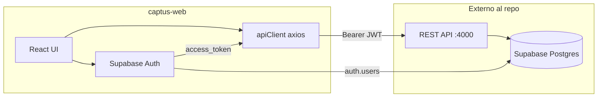

# Explore the codebase at D:\Github repos\captus-web to understand data models and APIs for:

**Fecha:** 2026-06-10  
**Agente:** cursor  
**Proyecto/contexto:** d-Github-repos-captus-web  
**Sesión:** `54ef0925-7d24-4fb2-8b0e-8aeb6e032895`  
**Origen:** `C:\Users\david\.cursor\projects\d-Github-repos-captus-web\agent-transcripts\90b57349-ef63-4235-ac3b-680b5ad8283e\subagents\54ef0925-7d24-4fb2-8b0e-8aeb6e032895.jsonl`

## Mensajes

### Usuario

Explore the codebase at D:\Github repos\captus-web to understand data models and APIs for: tasks (tareas), notes (notas), events (eventos), courses (cursos), and groups (grupos). Find database schemas, seed scripts, API endpoints, and how user data is associated. Return file paths, key models/schemas, and any existing seed/mock data patterns. Be thorough - check backend, database migrations, and any scripts folder.

### Asistente

Explorando el código para mapear modelos de datos y APIs de tareas, notas, eventos, cursos y grupos.


[tool:UpdateCurrentStep]
[tool:Glob]
[tool:Grep]
[tool:Glob]
[tool:Glob]

### Asistente

[tool:Glob]
[tool:Read]
[tool:Read]
[tool:Grep]
[tool:Glob]

### Asistente

[tool:Read]
[tool:Read]
[tool:Read]
[tool:Read]
[tool:Read]
[tool:Read]

### Asistente

[tool:Grep]
[tool:Read]
[tool:Read]
[tool:Read]
[tool:Read]
[tool:Glob]

### Asistente

[tool:Read]
[tool:Read]
[tool:Read]
[tool:Read]
[tool:Read]
[tool:Glob]

### Asistente

[tool:Read]
[tool:Read]
[tool:Read]
[tool:Read]
[tool:Grep]
[tool:Glob]

### Asistente

[tool:Read]
[tool:Read]
[tool:Read]
[tool:Read]
[tool:Grep]
[tool:Read]

### Asistente

[tool:Read]
[tool:Read]
[tool:Read]
[tool:Read]
[tool:Grep]
[tool:Read]

### Asistente

[tool:Grep]
[tool:Grep]
[tool:Read]
[tool:Read]
[tool:Read]

### Asistente

[tool:Read]
[tool:Read]
[tool:Read]
[tool:Read]
[tool:Grep]
[tool:Grep]

### Asistente

[tool:Read]
[tool:Read]
[tool:Grep]
[tool:Glob]
[tool:Read]

### Asistente

[tool:Read]
[tool:Read]
[tool:Read]
[tool:Grep]

### Asistente

[tool:Read]
[tool:Read]
[tool:Grep]
[tool:Read]

### Asistente

[tool:UpdateCurrentStep]

### Asistente

# Exploración: modelos de datos y APIs en captus-web

## Hallazgo principal

**Este repositorio es únicamente el frontend.** No hay carpeta `backend/`, **cero migraciones SQL**, **cero scripts de seed de base de datos** y **cero esquemas Prisma/ORM** en `D:\Github repos\captus-web`.

| Área | Estado en el repo |
|------|-------------------|
| Backend / API server | Externo → `http://localhost:4000` (proxy Vite en `/api`) |
| Base de datos / migraciones | No presentes |
| Seeds | No presentes |
| Scripts (`scripts/`) | Solo utilidades UI (dark mode, ARIA) — no datos |

El README confirma que el backend vive fuera: `npm run backend:dev` desde el monorepo raíz, mientras este repo arranca con `npm run dev`.

---

## Arquitectura de datos y asociación con usuarios



**Archivos clave de infraestructura:**

| Archivo | Rol |
|---------|-----|
| `D:\Github repos\captus-web\src\shared\api\client.js` | Cliente Axios; base URL `/api` o `VITE_API_BASE_URL`; inyecta JWT de Supabase |
| `D:\Github repos\captus-web\src\shared\api\supabase.js` | Cliente Supabase Auth (`VITE_SUPABASE_URL`, `VITE_SUPABASE_ANON_KEY`) |
| `D:\Github repos\captus-web\vite.config.js` | Proxy `/api` → `http://localhost:4000` |
| `D:\Github repos\captus-web\src\context\AuthContext.jsx` | Login/registro Supabase + `POST /users/sync` para sincronizar `public.users` |
| `D:\Github repos\captus-web\src\shared\api\unwrap.js` | Normaliza respuestas `{ success, data }` vs arrays planos |

**Patrón de asociación usuario:**
- Auth: Supabase (`user.id` UUID).
- Entidades personales (tareas, notas, eventos): el frontend envía explícitamente `user_id: user.id` en POST/PUT (p. ej. `useTasks.ts`).
- El backend filtra por JWT en la mayoría de GET; el comentario en `AuthContext.jsx` menciona tabla `public.users`.
- Roles: `user.user_metadata.role` → `'student' | 'teacher' | 'admin' | 'superadmin'`.

---

## Modelos TypeScript (fuente canónica del frontend)

**Archivo:** `D:\Github repos\captus-web\src\types\index.ts`

### Tareas personales (`Task`)

```typescript
id, title, description, due_date, completed, user_id,
category_id, priority_id, created_at, updated_at
// joins opcionales: category, priority
```

### Subtareas (`SubTask`) — nombres legacy del backend

```typescript
id_SubTask, title, description, state (boolean),
endDate, id_Category, id_Priority, parent_task_id, user_id, created_at
```

### Eventos (`CalendarEvent`)

```typescript
id, title, description, start_time, end_time,
event_type ('Reunión'|'Examen'|'Entrega'|'Clase'), user_id, created_at
```

> **Nota:** El UI usa campos distintos al enviar: `start_date`, `end_date`, `type`, `notify` (ver `EventFormModal.jsx`).

### Notas (`Note`)

```typescript
id, title, content, user_id, created_at, updated_at
```

> El UI también usa `subject`, `is_pinned`/`pinned`; el color es solo cliente.

### Cursos (`Course`)

```typescript
id, name, description, teacher_id, code, color, created_at
```

> El UI usa frecuentemente `title`, `professor`, `progress` — el backend devuelve más campos que el tipo.

### Referencia

- `Category`: `id, name, color?, u

_[truncado]_


## Enlaces
- Índice: [[cursor-import-index]]
- Home: [[Home]]
