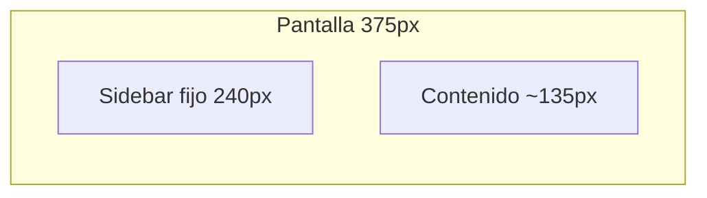

# revisa que tan bien esta implementada la visualizacion de la aplicacion en dispositivos mo

**Fecha:** 2026-06-10  
**Agente:** cursor  
**Proyecto/contexto:** d-Github-repos-captus-web  
**Sesión:** `ae8bb766-d6fd-4702-8ffa-ce79152a3bd9`  
**Origen:** `C:\Users\david\.cursor\projects\d-Github-repos-captus-web\agent-transcripts\ae8bb766-d6fd-4702-8ffa-ce79152a3bd9\ae8bb766-d6fd-4702-8ffa-ce79152a3bd9.jsonl`

## Mensajes

### Usuario

revisa que tan bien esta implementada la visualizacion de la aplicacion en dispositivos moviles

### Asistente

Revisaré la implementación responsive de la app: estructura del proyecto, estilos, breakpoints y componentes clave en móvil.


[tool:Glob]
[tool:SemanticSearch]
[tool:Grep]

### Asistente

[tool:Read]
[tool:Read]
[tool:Read]
[tool:Grep]

### Asistente

[tool:Read]
[tool:Read]
[tool:Read]
[tool:Read]
[tool:Grep]

### Asistente

[tool:Grep]
[tool:Read]
[tool:Read]
[tool:Read]
[tool:Read]

### Asistente

[tool:Read]
[tool:Read]
[tool:Grep]
[tool:Read]

### Asistente

[tool:Read]
[tool:Read]
[tool:Glob]
[tool:Read]

### Asistente

[tool:Grep]
[tool:Glob]

### Asistente

[tool:Read]
[tool:Read]
[tool:Shell]

### Asistente

[tool:CallMcpTool]

### Asistente

[tool:Shell]
[tool:CallMcpTool]

### Asistente

[tool:Grep]
[tool:Read]
[tool:Read]
[tool:Read]

### Asistente

[tool:Read]
[tool:Read]
[tool:Read]

### Asistente

[tool:Read]
[tool:Read]
[tool:Read]

### Asistente

[tool:Grep]
[tool:Read]

### Asistente

[tool:Read]
[tool:Read]

### Asistente

[tool:Glob]
[tool:Read]

### Asistente

## Veredicto general

La visualización móvil está **parcialmente implementada y de forma inconsistente**. Hay buenas bases (viewport, Tailwind, grids que colapsan, tokens táctiles en UI), pero el **layout principal no está pensado para móvil**. En pantallas de ~375px la app queda prácticamente inutilizable en las secciones autenticadas.

**Calificación aproximada: 4/10 en móvil** (landing ~6/10, app interna ~2–3/10).

---

## Lo que sí está bien

### Fundamentos
- Meta viewport correcta en `index.html`.
- Uso extendido de utilidades responsive de Tailwind (`grid-cols-1 md:grid-cols-2`, `flex-col md:flex-row`, `p-6 md:p-8`).
- Componentes UI con tamaños aptos para touch: inputs de 48px, botones grandes, `active:scale-95`.

### Páginas con mejor adaptación
- **Landing**: tipografía escalable (`text-5xl md:text-7xl`), CTAs en columna en móvil (`flex-col sm:flex-row`), grids que pasan a 1 columna.
- **Varias vistas internas**: cursos, grupos, notificaciones, configuración usan grids responsivos y `pb-24` para el botón flotante de IA.
- **Diálogos**: `max-h-[90vh] overflow-y-auto` evita que modales se salgan de la pantalla.
- **Tablas**: wrapper con `overflow-x-auto` en `table.jsx`.

---

## Problema crítico: el shell de la aplicación

El mayor bloqueo es `MainLayout` + `Sidebar`:

```30:34:src/features/dashboard/components/MainLayout.jsx
      <main
        id="main-content"
        className={`min-h-screen transition-all duration-300 ease-[cubic-bezier(0.4,0,0.2,1)] ${
          isCollapsed ? 'ml-20' : 'ml-60'
        }`}
```

El sidebar siempre es fijo (`w-60` = 240px o `w-20` = 80px) y el contenido **siempre** tiene margen izquierdo equivalente. No hay breakpoints `md:` ni menú hamburguesa.

En un iPhone de 375px de ancho:

| Estado sidebar | Ancho sidebar | Ancho útil del contenido |
|----------------|---------------|--------------------------|
| Expandido      | 240px (~64%)  | ~135px                   |
| Colapsado      | 80px (~21%)   | ~295px                   |



Mismo patrón en `TeacherSidebar` y en el panel admin (`AdminLayout` con sidebar siempre visible en flex horizontal).

**Consecuencias:**
- Texto cortado, cards comprimidas, calendario ilegible.
- No hay navegación móvil alternativa (drawer, bottom bar, overlay).
- El botón de colapsar no resuelve el problema en móvil.

---

## Problemas por área

### Landing (`LandingNav`)
- Los enlaces de sección están en `hidden md:flex` **sin menú móvil alternativo**.
- En móvil solo quedan logo + dos botones; no hay forma de saltar a #problema, #solución, etc. sin scroll manual.
- Los dos botones del header pueden quedar apretados en pantallas muy estrechas.

### Calendario
- Vista mes: `grid-cols-7` con celdas `min-h-32` — demasiado denso en móvil.
- Vista semana: 7 columnas horizontales sin `overflow-x-auto` — eventos ilegibles.
- No hay vista por defecto “día” en pantallas pequeñas ni selector simplificado.

### Chatbot (doble sidebar)
`ChatBotPage` está dentro de `MainLayout`, así que en móvil coexisten:
1. Sidebar de navegación de la app (240px)
2. Sidebar propio del chat (260px, abierto por defecto con `showSidebar = true`)

El área de mensajes queda reducida a casi nada.

### Padding inconsistente
Algunas páginas usan padding responsivo y espacio para el FAB; otras no:

| Con `p-6 md:p-8 pb-24` | Solo `p-8` fijo |
|------------------------|-----------------

_[truncado]_

### Usuario

okey, adelante pero procede con cuidado

### Asistente

Implementaré el layout móvil con cambios mínimos y seguros: revisaré los archivos clave y aplicaré drawer + `ml-0` en pantallas pequeñas.


[tool:Read]
[tool:Read]
[tool:Read]
[tool:Grep]

### Asistente

[tool:Glob]
[tool:Glob]
[tool:Read]

### Asistente

Creando un hook ligero y actualizando el layout con drawer en móvil, sin alterar el comportamiento en escritorio.


[tool:Write]
[tool:Write]

### Asistente

[tool:StrReplace]
[tool:Write]
[tool:Write]

### Asistente

Ajustando el chatbot para móvil y añadiendo navegación de regreso cuando el sidebar principal está oculto.


[tool:StrReplace]
[tool:StrReplace]
[tool:StrReplace]
[tool:StrReplace]

### Asistente

[tool:ReadLints]
[tool:Shell]

### Asistente

[tool:Shell]

### Asistente

[tool:Await]

### Asistente

[tool:Read]

### Asistente

[tool:Await]

### Asistente

[tool:Read]

### Asistente

Implementé el soporte móvil del shell principal con cambios acotados. El build de producción terminó correctamente.

## Cambios realizados

### 1. Hook `useIsMobile` (`src/hooks/useMediaQuery.js`)
Detecta viewports ≤767px (breakpoint `md` de Tailwind) y reacciona al redimensionar la ventana.

### 2. `MainLayout` — drawer en móvil
- **Móvil**: contenido a ancho completo (`ml-0`), sin sidebar visible por defecto.
- **Barra superior** con botón hamburguesa para abrir el menú.
- **Overlay** semitransparente al abrir el drawer; se cierra al tocar fuera o al cambiar de ruta.
- **Escritorio**: sin cambios (`ml-20` / `ml-60` según colapso).
- **Chatbot en móvil**: se oculta el sidebar de la app para evitar el doble panel.

### 3. `Sidebar` y `TeacherSidebar`
- En móvil: drawer deslizable (`translate-x`), siempre ancho completo con etiquetas visibles.
- Botón **X** para cerrar en lugar del colapsar.
- Los enlaces cierran el drawer al navegar.
- En escritorio: comportamiento anterior intacto.

### 4. `ChatBotPage`
- Panel de conversaciones **cerrado por defecto** en móvil.
- Botón **volver al inicio** (`←`) en el header móvil (la app no muestra su menú en `/chatbot`).
- Al elegir una conversación en móvil, el panel lateral se cierra automáticamente.

## Comportamiento esperado

| Contexto | Antes | Ahora |
|----------|-------|-------|
| Home en 375px | ~135px de contenido útil | ~375px + menú en drawer |
| Chatbot móvil | Doble sidebar | Pantalla completa para el chat |
| Escritorio | Igual | Igual |

## Qué quedó fuera (a propósito)

Para no ampliar el alcance en esta pasada:
- Panel **admin** (sigue con sidebar fijo en móvil)
- **Landing** sin menú hamburguesa
- **Calendario** (vista semana/mes densa)
- Padding `p-8` fijo en algunas páginas

Puedes probar con `npm run dev` y las DevTools en modo responsive (375px). Si quieres, el siguiente paso natural sería el panel admin o el menú de la landing.

### Usuario

sube los cambios a github

### Asistente

[tool:Shell]
[tool:Shell]
[tool:Shell]
[tool:Shell]

### Asistente

[tool:Shell]

### Asistente

[tool:Shell]

### Asistente

[tool:Read]
[tool:Shell]

### Asistente

El commit anterior incluyó archivos incorrectos por un bloqueo de git; lo corrijo y vuelvo a commitear solo los cambios de layout móvil.


[tool:Shell]

### Asistente

[tool:Shell]

### Asistente

[tool:Shell]

### Asistente

[tool:Shell]

### Asistente

Los cambios ya están en GitHub.

**Commit:** `5c81832` — `feat(layout): add mobile drawer navigation and fullscreen chatbot`  
**Repositorio:** https://github.com/Raikadier/captus-web  
**Rama:** `main`

### Archivos incluidos en el push
- `src/hooks/useMediaQuery.js` (nuevo)
- `src/features/dashboard/components/MainLayout.jsx`
- `src/features/dashboard/components/Sidebar.jsx`
- `src/features/dashboard/components/TeacherSidebar.jsx`
- `src/features/chatbot/ChatBotPage.jsx`

### No incluidos (siguen solo en local)
- Cambios en notas (`NoteContent.jsx`, `NotesPage.jsx`)
- Tests Selenium
- Borrado de `coverage/`
- Carpetas `captures/`, `documento de software ii/`, etc.

Si quieres, puedo subir también los cambios de notas o los tests en otro commit.

### Usuario

Briefly inform the user about the task result and perform any follow-up actions (if needed). If there's no follow-ups needed, don't explicitly say that.

### Usuario

Briefly inform the user about the task result and perform any follow-up actions (if needed). If there's no follow-ups needed, don't explicitly say that.

### Usuario

Briefly inform the user about the task result and perform any follow-up actions (if needed). If there's no follow-ups needed, don't explicitly say that.

### Usuario

Briefly inform the user about the task result and perform any follow-up actions (if needed). If there's no follow-ups needed, don't explicitly say that.

### Usuario

Briefly inform the user about the task result and perform any follow-up actions (if needed). If there's no follow-ups needed, don't explicitly say that.

### Usuario

Briefly inform the user about the task result and perform any follow-up actions (if needed). If there's no follow-ups needed, don't explicitly say that.

### Asistente

El push a GitHub se completó correctamente.

**Commit:** `5c81832` en `main` — layout móvil con drawer, sidebar adaptable y chatbot a pantalla completa en móvil.

Los cambios de notas, tests Selenium y `coverage/` siguen solo en tu máquina local, sin subir.


## Enlaces
- Índice: [[cursor-import-index]]
- Home: [[Home]]
